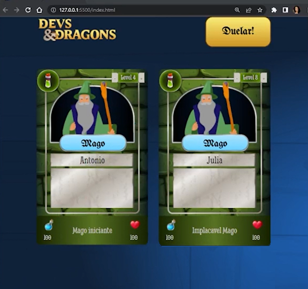
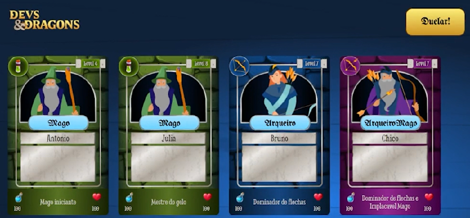
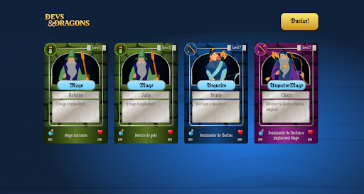

# Curso Alura JavaScript classes e heranças no desenvolvimento de aplicações com orientação a objetos

## Aula 01 - Hello POO!

### Aula 01 - Apresentação - Vídeo 1

Transcrição  
Ana Beatriz (Bia): Olá, eu sou a Ana Beatriz, mas podem me chamar de Bia. Sou instrutora de Front-end aqui na Alura.

Autodescrição da Bia: Mulher de pele morena. Tem cabelos longos e cacheados na cor castanho escuro com pontas mais claras. Tem o rosto redondo, sobrancelhas bem desenhadas, olhos castanhos, nariz médio e lábios grossos. Está usando óculos de lentes transparentes com a armação oval preta e fina. Está usando uma camiseta laranja. No fundo há uma parede lisa, sem decoração e com uma iluminação de cor azul.

Nayanne Batista (Nay): Olá! Eu sou a Nay!

Autodescrição da Nay: Mulher de pele morena. Tem cabelos longos e lisos na cor castanho. Tem o rosto quadrado, sobrancelhas bem desenhadas, olhos castanhos, nariz médio e boca média com um batom marrom claro. Está usando um óculos de lentes transparentes com uma armação também transparente. Está usando uma blusa laranja. O fundo está iluminado por uma luz azul e à esquerda tem uma janela coberta por uma persiana, à direita tem um violão e centralizado há uma estante branca com vários livros.

Junto com a Bia, vou acompanhar vocês ao longo do curso. Com ele vocês aprenderão os pilares da programação orientada a objetos. Vocês entenderão sobre:

- Classes
- Herança
- Encapsulamento
- Polimorfismo
- Composição

E muito mais.  
O melhor de tudo é que utilizarão esses conceitos de forma prática no nosso mais novo projeto: o Devs & Dragons (Devs e Dragões).

Vamos lá!

### Aula 01 - Preparando o ambiente

Olá, Dev! Tudo bem?  
Primeiramente gostaria de dizer que a nerd que habita em mim, saúda a pessoa nerd que habita em você!

É muito bom te receber por aqui, nesse treinamento de Orientação a Objetos(OO) com JavaScript. Espero que seja uma experiência de aprendizado incrível, onde eu e você iremos vencer todos os desafios que aparecerem pela frente.

Ao longo do percurso, você irá aprender sobre os principais pilares da Orientação a Objetos, ou seja, sobre Classes, Herança, Composição, Polimorfismo, Encapsulamento e muito mais! Neste curso, vamos utilizar o que construirmos com OO para renderizar no layout da página um projeto bem bacana que é o Devs&Dragons.

Antes de colocar a mão na massa, é importante que o seu ambiente de desenvolvimento esteja 100% sincronizado com o meu, então veja algumas informações que deixei abaixo:

Preparando o ambiente  
Neste treinamento, usaremos o editor de código [Visual Studio Code](https://code.visualstudio.com/download). Ele pode ser baixado tanto para Windows, como Linux ou Mac.

Além disso, estamos usando o Chrome como navegador principal e é importante tê-lo instalado em seu computador.

Caso você queira dar uma olhada no layout, esse é o [figma do projeto!](https://www.figma.com/community/file/1418663911280735423)

> Lembrando que você está totalmente livre para customizar o CSS do seu projeto da maneira que desejar, inclusive, iremos adorar ver como ficou o seu resultado personalizado!

E por último e não menos importante, o foco aqui é trabalhar POO com JavaScript! Então para que eu e você possamos nos direcionar totalmente para esse tema, é necessário que você [baixe o zip do projeto base](https://github.com/alura-cursos/cartas-personagens/archive/edfeec1395c2708f8b1b7b7370b6226658b976f3.zip) ou [acesse os arquivos no Github](https://github.com/alura-cursos/cartas-personagens/tree/edfeec1395c2708f8b1b7b7370b6226658b976f3) antes de iniciarmos.

É de extrema importância que após baixar o projeto base, você dê uma boa navegada pelos arquivos para entender exatamente o que já está sendo aplicado.

Recomendações extras  
Para acompanhar as aulas do curso, recomendo que você tenha a extensão Live Server instalada, pois ela irá nos proporcionar visualizarmos as alterações ao vivo das modificações na página.

Para realizar testes, responder as atividades e desafios do curso de forma mais rápida e simplificada, sugiro o uso do [CodePen](https://codepen.io/).

> A Alura conecta pessoas que são encantadas e apaixonadas por tecnologia, que acreditam no poder da educação e que amam compartilhar conhecimento. Então lembre-se, em caso de dúvidas ao decorrer do curso, conte sempre com o discord e o fórum para te ajudar. Caso não tenha dúvidas, fique a vontade para compartilhar seu aprendizado, insights e projetos por lá, tenho certeza que ajudará outras pessoas e iremos adorar acompanhar o seu progresso.

### Aula 01 - Quando usar Classes? - Vídeo 2

Transcrição  
Observação: A instrutora Bia que vai apresentar essa aula.

Estou com o nosso projeto D&D (Devs & Dragons) aberto no VS Code, onde já existem dois objetos criados no index.js: o personagem "Pedrinho" e o personagem "José".

```JavaScript
const personagemPedrinho = {
    nome: 'Pedrinho',
    vida: 7,
    mana: 12,
    level: 5,
    tipo: 'Mago',
}
const personagemJose = {
    nome: 'Jose',
    vida: 7,
    mana: 6,
    level: 3,
    tipo: 'Arqueiro',
}
```

Reparem que eles têm algumas propriedades, que são "nome", "vida", "mana", que é o nível de poder ou de energia do personagem, "level" (nível) e "tipo". Vamos aprender como fazer para criar mais uma personagem.

Na linha 17, codamos const personagemAna = {}, sendo que Ana é o nome que quero dar para essa personagem. Em seguida, dentro das chaves, preenchemos as propriedades da personagemAna.

```JavaScript
const personagemAna = {
    nome: 'Ana',
    vida: 8,
    mana: 10
}
```

Porém imaginem a quantidade de cartas que tem em um baralho de RPG (Role Play Game, traduzido como Jogo de Interpretação de Papéis). Ao pesquisarmos essa informação no Google, descobrimos que no baralho de RPG tem em torno de 52 cartas.

Pensem comigo, se cada objeto representa uma carta de personagem, criar essas personagens uma a uma não seria muito prático, principalmente porque cada personagem possuirá as mesmas propriedades. Para solucionarmos isso, na linha 23 criaremos um modelo contendo todos os dados que são comuns nesses objetos.

```JavaScript
//código omitido
class Personagem {
    nome
    vida
    mana
}
```

Por enquanto vamos deixar nosso modelo dessa forma. Em seguida, comentaremos da linha 1 a linha 7, onde tem o bloco de código do personagem "Pedrinho", usando /* */.

```JavaScript
/*const personagemPedrinho = {
    nome: 'Pedrinho',
    vida: 7,
    mana: 12,
    level: 5,
    tipo: 'Mago',
}*/
```

Depois vamos transformar esse personagem em variável, então vamos selecionar const personagemPedrinho na linha um, pressionar "Ctrl + C", e depois, na linha 29, pressionamos "Ctrl + V". Nós iremos codar que o personagemPedrinho é igual a new Personagem().

```JavaScript
const personagemPedrinho = new Personagem()
```

Feito isso vamos pressionar "Enter" e na linha 30, ao escrevermos personagemPedrinho. aparecem sugestões de autocomplete do VS Code com as propriedades que escrevemos na classe Personagem(). Sendo assim, vamos começar a preencher.

```JavaScript
//código omitido

const personagemPedrinho = new Personagem()
personagemPedrinho.nome = 'Pedrinho'
personagemPedrinho.mana = 12
personagemPedrinho.vida = 7
```

Agora precisamos adicionar novas propriedades do personagem, e para isso precisamos alterar classe Personagem(). Vamos adicionar "level", "tipo" e "descricao", que será a descrição do personagem.

```JavaScript
class Personagem {
    nome
    vida
    mana
    level
    tipo
    descricao
}
```

Agora quando escrevermos, na linha 36, personagemPedrinho. já aparecem as novas propriedades que adicionamos à classe Personagem(). Isso acontece porque declaramos que personagemPedrinho comporta um new Personagem(), ou seja, informamos que a variável personagemPedrinho é uma instância da classe Personagem().

Quando escrevemos class criamos uma classe que é um modelo contendo todas as informações em comum dos objetos que serão criados a partir dela. Portanto criamos uma conexão entre o que a classe tem e o que o objeto terá. A partir da classe, diversos objetos podem ser criados.

Ao deixarmos o mouse sobre Personagem() na linha 32, reparamos que o VS Code informa que ele e um constructor (construtor), utilizado para construir algo, que é exatamente o que estamos fazendo. E isso que nós criamos pode ser facilmente trazido para o mundo real.

Imagine em um sistema de banco termos um classe chamada classeCliente contendo diversas propriedades, como:

Nome
CPF
Agência

A partir da classeCliente é possível criar diversos clientes, então tem as instâncias dos clientes 2000, 2001 e assim por diante. Portanto esse foi o primeiro passo para solucionar a questão de repetição das propriedades que nós começamos a aprender.

Ainda temos muito para evoluir, então vejo vocês no próximo vídeo.

### Aula 01 - Para saber mais: instanceof

instanceof  
O operador instanceof testa se um objeto possui como protótipo ou modelo, que atua como uma determinada classe ou função construtora, o seu valor de retorno é um booleano .

Tendo o seguinte código:

```JavaScript
export class Personagem {
    nome
    vida
    mana
    level
    tipo
    obterInsignia() {
        if (this.level >= 5) {
            return `Implacavel ${ this.tipo }`
        }
        return `${ this.tipo } iniciante`
    }
}
const personagemJack = new Personagem()
```

Testando!

```JavaScript
console.log(personagemJack instanceof Personagem) 
```

O retorno no console é true, visto que quando foi escrito const personagemJack = new Personagem(), esse objeto se tornou uma instância da classe Personagem.

Caso fosse testado que personagemJack é uma instância de outra classe, por exemplo:

```JavaScript
class Mago {
    magia = 10
}
console.log(personagemJack instanceof Mago)
```

O resultado no console seria false.

Isso porque o grande objetivo dessa palavra chave é verificar se aquela instância foi ou não foi criada a partir de uma determinada classe.

### Aula 01 - Import e export - Vídeo 3

Transcrição  
Agora que construímos a classe Personagem(), nesse vídeo vamos organizar a estrutura de classes e arquivos no nosso projeto da maneira que é feito ao utilizarmos esse tipo de modelo de classes.

Para isso acessaremos o Explorador, que é a coluna à esquerda, e dentro da pasta "src" criaremos uma nova pasta. Então clicamos em "src", para encolhê-la, e depois no ícone de uma pasta com um "+" no canto inferior direito. Esse ícone de "Nova pasta" é o segundo da esquerda para direita na parte superior direita do Explorador. Vamos nomear essa pasta como "modules" ("módulos").

Com a pasta "modules" selecionada, criaremos um novo arquivo dentro dela, clicando no primeiro ícone da esquerda para direita na parte superior direita do Explorador. Esse ícone de "Nova arquivo" tem o formato de uma folha com o canto superior direito dobrado e tem um "+" no canto inferior direito. Nomearemos o arquivo como "personage.js".

Retornando ao "src > index.js", apagaremos a linha 36, onde está escrito apenas personagemPedrinho.. Em seguida, vamoms selecionar o bloco da classe Personagem(), da linha 23 a 30, pressionar "Ctrl + X" e vamos colar no arquivo personagem.js.

```JavaScript
class Personagem {
    nome
    vida
    mana
    level
    tipo
    descricao
}
```

Essa forma que nós fizemos é a recomendada pela documentação do MDN. Trata-se de uma boa prática, porque nos últimos anos começaram a pensar em maneiras de melhorar a usabilidade e manutenção do código. Uma das formas a qual chegaram foi a de separar o código em pequenos módulos que só seriam utilizados quando fossem necessários.

Tanto que, no arquivo "index.html", o script da linha 33, que chama o index.js modifica seu type (tipo). Atualmente temos:

```JavaScript
<script type="module" src="./src/index.js"></script>
```

Então temos o type="module" porque a maioria dos navegadores reconhece esse tipo. Porém para o arquivo ser interpretado dessa forma, ele precisa ser do tipo module. Por isso essa modificação.

Agora voltamos para o index.js e, na linha 28, vamos codar:

```JavaScript
console.log(personagemPedrinho)
```

Assim poderemos visualizar esse objeto. Quando acessamos o Console do navegador onde está nossa página, encontramos um erro informando que "Personagem is not defined" ("Personagem não está definido"), e que esse erro está acontecendo na linha 23 do "index.js". Portanto é justamente na linha onde o new Personagem() parou de funcionar.

Para resolver isso, voltaremos para o arquivo "personagem.js" e na linha 1, antes de class Personagem {}, escreveremos export.

```JavaScript
export class Personagem {
    /*código omitido*/
```

De volta ao "index.js", clicaremos no começo da linha 1 e pressionaremos "Enter" duas vezes para descer o código comentado para linha 3. Depois voltaremos à linha 1 para fazer a importação da classe Personagem.

```JavaScript
import { Personagem } from "./modules/personagem.js"

/*const personagemPedrinho = {
    nome: 'Pedrinho',
    vida: 7,
    mana: 12,
    level: 5,
    tipo: 'Mago',
}*/

/*código omitido*/
```

Percebam que ao escrevermos import { Personagem }, a importação se autocompleta, mas é importante que o endereço de onde está sendo importado termine em personagem.js. O .js é muito importante, ou a importação não irá funcionar.

Vamos salvar o código e, ao retornarmos para o Console do navegador, observamos que a instância personagemPedrinho voltou a funcionar. Sendo assim, recebemos várias informações de personagemPedrinho.

Personagem {nome: 'Pedrinho', vida: 7, mana: 12, level: undefined, tipo: undefined, ...}

descricao: undefined

level: undefined

mana: 12

nome: "Pedrinho"

tipo: undefined

vida: 7

[[Prototype]]: Object

As propriedades de nome, vida e mana estão preenchidas, e as propriedades que não atribuímos valor está como undefined (indefinido). Além disso, conseguimos visualizar na primeira linha que personagemPedrinho é uma instância da classe Personagem.

Essa ação que nós precisamos fazer de import e export foi porque o script que criamos, que é um módulo, depende dessas palavras reservadas. Basicamente o export (exportar) envia o pedaço de código para algum lugar e o import (importar) busca esse código que foi enviado.

Agora que nosso projeto está devidamente organizado, vamos evoluir ainda mais essa classe personagem.

### Aula 01 - Para saber mais: orientação a objetos

Agora que você está entrando no universo da Orientação a objetos (OO), te convido a [assistir um episódio do #HipsterPontoTube](https://youtu.be/jpuJ1qrluoU) no canal do youtube da Alura, onde o Paulo Silveira bate um papo com a Roberta Arcoverde sobre a utilização de orientação a objeto e suas aplicações.

### Aula 01 - Sobre o this - Vídeo 4

Transcrição  
As classes possuem características, ou seja, propriedades, e comportamentos. Nesse vídeo construiremos o primeiro método na classe Personagem().

Com o arquivo "personagem.js" aberto, vamos clicar ao final de descricao, na linha 7, e pressionar "Enter" duas vezes. Na linha 9, ou seja, dentro da classe e depois das propriedades, escreveremos obterInsignia(){}. Dentro das chaves ({}) desse método, vamos codar a condicional.

```JavaScript
export class Personagem {
    nome
    vida
    mana
    level
    tipo
    descricao

    obterInsignia() {
        if(this.level >= 5){
            return 'Implacavel ${this.tipo}'
        }
        return '${this.tipo} iniciante'
    }
}
```

Então verificamos se o nível é maior ou igual a 5, retorna a frase com "Implacavel" e o tipo do personagem. Caso contrário, retorna o tipo do personagem e informa que ele é "iniciante". E para concatenar essas informações usamos o cifrão e as chaves (${}).

Salvamos essa alteração e no arquivo "index.js" vamos terminar de preencher as propriedades do personagemPedrinho.

```JavaScript
//código omitido

const personagemPedrinho = new Personagem()
personagemPedrinho.nome = 'Pedrinho'
personagemPedrinho.mana = 12
personagemPedrinho.vida = 7
personagemPedrinho.tipo = 'Mago'
personagemPedrinho.level = 5
```

Vamos aproveitar para criarmos uma nova instância. Para isso, vamos comentar o bloco sobre o personagemJose, ou seja, da linha 11 a linha 17, usando /* */.

```JavaScript
/*const personagemJose = {
    nome: 'Jose',
    vida: 7,
    mana: 6,
    level: 3,
    tipo: 'Arqueiro',
}*/
```

Em seguida, vamos selecionar o const personagemJose, na linha 11, copiar com "Ctrl + C" e reutilizarmos essa variável na linha 32, pressionando "Ctrl + V". Então na linha 32 codaremos const personagemJose = new Personagem() e em seguida vamos completar as informações de nome, tipo e nível do personagem.

```JavaScript
const personagemJose = new Personagem()
personagemJose.nome = 'Jose'
personagemJose.tipo = 'Arqueiro'
personagemJose.level = 3
```

Agora vamos testar se a obterInsignia está funcionando. Para isso, na linha 37, vamos apagar o console.log(personagemPedrinho) e no lugar vamos codar:

```JavaScript
//código omitido
console.log('Insígnia de ' + personagemPedrinho.nome + ': ' + personagemPedrinho.obterInsignia())
```

Podemos, inclusive, aumentar o tamanho da tela para observarmos melhor o código.

Após escrevê-lo, vamos selecionar toda linha 37 e pressionar "Ctrl + C" para copiá-la. Ao final da linha 37 vamos pressionar "Enter" e vamos colar o código na linha 38, pressionando "Ctrl + V".

Na linha 38, selecionamos Pedrinho, pressionamos "Ctrl + D", e vamos substituí-lo por Jose nos dois locais ao mesmo tempo.

```JavaScript
//código omitido
console.log('Insígnia de ' + personagemPedrinho.nome + ': ' + personagemPedrinho.obterInsignia())
console.log('Insígnia de ' + personagemJose.nome + ': ' + personagemJose.obterInsignia())
```

Salvamos o código e voltamos para onde nosso projeto está aberto junto ao Console da página. Quando o projeto renderiza, no Console temos as informações do método obterInsignia, e eu vou ampliar para ficar mais fácil de visualizarmos.

Insígnia de Pedrinho: Implacavel Mago

Insígnia de Jose: Arqueiro Iniciante

Voltando para o arquivo "personagem.js", observamos que ao criarmos o obterInsignia, cujo papel fundamental é gerar uma insígnia para o personagem, ela verifica o level. Se ele for maior ou igual a 5, a insígnia é "Implacável tipo_do_personagem", caso contrário é "tipo_do_personagem iniciante".

Porém, quando criamos o método dentro da classe, não sabemos que personagem está chamando esse método, se é o Pedrinho, o Jose ou a Ana. Então vamos usar uma palavra reservada, que é o this para chamar o this.level e o this.tipo.

O this se traduz como "isto", ou seja, é algo que não conhecemos quando estamos criando o dentro da classe. Porque essa informação será gerada a partir da instância, que vai mudar o estado interno da classe, ou seja, o contexto da classe.

Voltando para o "index.js", reparem que ao escrevermos na linha 29 personagemPedrinho.tipo = 'Mago', o this.tipo que codamos na classe vira "Mago". Por outro lado, na linha 34 codamos personagemJose.tipo = 'Arqueiro', então o this.tipo da classe será "Arqueiro". Essa regra também se aplica ao level.

Isso significa que essas informações da classe, quando usam o this vai depender da instância, e a instância tem a responsabilidade de alterar o estado interno da classe. Portanto o this é algo que não conhecemos quando estamos construindo dentro da classe.

Lembram que conversamos que Personagem é um constructo? Chegou o momento de conversamos de forma mais aprofundada sobre a palavra constructor.

### Aula 01 - Mudando de acordo com o contexto - Exercício

Você aprendeu sobre o que a palavra chave this representa, atuando como um estado interno de um determinado contexto. Diante disso, analise o código abaixo e assinale as alternativas corretas:

```JavaScript
 class Animal {
    nome
    tipo
    som
    imprimeSom() {
      return `Meu ${this.tipo} ${this.nome} faz ${this.som}`
    }
}
  const gatinhoTom = new Animal()
  gatinhoTom.tipo = 'gatinho'
  gatinhoTom.som = 'meaaaw'

  const doguinhoBob = new Animal()
  doguinhoBob.nome = 'Bob'
  doguinhoBob.tipo = 'catioro'
  doguinhoBob.som = 'auau'

console.log(doguinhoBob.imprimeSom())
console.log(gatinhoTom.imprimeSom())
```

Alternativa correta  
Na linha 23, o console.log(doguinhoBob.imprimeSom()) irá retornar “Meu catioro Bob faz auau”.

> Isso porque para a instância doguinhoBob da classe Animal, o contexto do this.nome é Bob, o this.tipo é catioro e o this.som é auau, formando então esta frase.

Alternativa correta  
Na linha 25, o console.log(gatinhoTom.imprimeSom()) irá retornar “Meu gatinho undefined faz meaaaw”.

> Como a propriedade nome da instância ou objeto gatinhoTom não foi definida, o this.nome não encontrará nenhum valor e por isso irá trazer o undefined.

## Aula 02 - Constructors e Renderização

### Aula 02 - Construindo por parâmetro - Vídeo 1

Transcrição  
Observação: Esta aula será apresentada pela instrutora Bia.

Nosso projeto tem duas instâncias criadas: personagemPedrinho e personagemJose. Contudo, após criarmos através do new Personagem() é necessário escrever o valor de cada propriedade individualmente.

Vamos otimizar a forma de realizar esse processo. Para isso, acessaremos o arquivo personagem.js. Abaixo das propriedades e acima de obterInsignia(), adicionaremos um constructor() e um bloco de chaves {}.

Entre os parênteses escreveremos as propriedades nome, level e tipo, separando-as com uma vírgula. Por enquanto não vamos nos preocupar com as outras propriedades.

Dentro do bloco de chaves adicionaremos os comandos abaixo, um em cada linha:

```JavaScript
this.nome = nome;
this.level = level e
this.tipo = tipo.
export class Personagem {
    nome
    vida
    mana
    level
    tipo
    descricao
    constructor(nome, level, tipo) {
        this.nome = nome
        this.level = level
        this.tipo = tipo
    }
```

Salvaremos o código e retornaremos ao arquivo index.js. Nele apagaremos todo o código, mantendo somente o import.

```JavaScript
import { Personagem } from "./modules/personagem.js"
```

Duas linhas abaixo do import adicionaremos uma const personagemPedrinho que receberá o sinal = e um new Personagem().

```JavaScript
import { Personagem } from "./modules/personagem.js"

const personagemPedrinho = new Personagem()
```

O VS Code lança um dropdown dizendo que Personagem possui três argumentos como parâmetro: nome, level e tipo, que são justamente as propriedades inseridas no constructor.

Inicialmente o VS Code destaca a propriedade nome. Vamos adicionar o nome Pedrinho entre aspas simples e dentro dos parênteses de new Personagem().

```JavaScript
import { Personagem } from "./modules/personagem.js"

const personagemPedrinho = new Personagem('Pedrinho')
```

Neste momento o VS Code passa a destacar a propriedade level. Vamos adicionar o valor dela: 5.

Não podemos esquecer de separar os valores com uma vírgula.

```JavaScript
import { Personagem } from "./modules/personagem.js"

const personagemPedrinho = new Personagem('Pedrinho', 5)
```

Por fim, o VS Code passa a destacar a propriedade tipo. Vamos adicionar a ele o tipo mago entre aspas simples.

```JavaScript
import { Personagem } from "./modules/personagem.js"

const personagemPedrinho = new Personagem('Pedrinho', 5, 'Mago')
```

Faremos o mesmo procedimento para personagemJose, adicionando o nível 3 e o tipo Arqueiro.

```JavaScript
import { Personagem } from "./modules/personagem.js"

const personagemPedrinho = new Personagem('Pedrinho', 5, 'Mago')
const personagemJose = new Personagem('Jose', 3, 'Arqueiro')
```

O processo se tornou mais prático do que adicionar cada elemento separadamente. Contudo, temos um novo termo: o constructor.

O que é um constructor?  
Trata-se de um método especial que só é executado quando a instância é criada. Nos parâmetros dele adicionamos variáveis que serão requisitadas por essa instância.

A partir do momento que criamos o personagemPedrinho, dizemos que ele é um new Personagem e passamos os seus valores, as variáveis do constructor() carregam esses valores e os associam às propriedades da classe.

No caso de personagemPedrinho, estamos enviando Pedrinho como o valor de nome para a variável do constructor, e portanto ela será associada a this.nome.

Estamos utilizando o this pois não sabemos qual será o nome desse personagem — pode ser Pedrinho, Jose, Ana ou qualquer outro.

Importante: Dentro de uma classe só poderá existir um método constructor(). Se criarmos mais de um, será lançado um erro de sintaxe.

Vimos as informações de personagemPedrinho e personagemJose sendo renderizadas no console. Contudo, essa não é a ideia do curso. Aqui, renderizaremos todo o avanço do nosso projeto em um layout na página.

A seguir, vamos nos ajudar para realizar essa tarefa. Nos vemos no próximo vídeo.

### Aula 02 - Criando a view - Vídeo 2

Transcrição  
Além da pasta "modules" que criamos, o nosso projeto conta com diversas outras pastas e arquivos que foram disponibilizados no projeto base, localizado na atividade "Preparando o ambiente"https://cursos.alura.com.br/course/javascript-orientacao-a-objetos/task/120244.

Acessaremos o explorador de arquivos na lateral esquerda do VS Code. A pasta "src" estará aberta, e dentro dela veremos as seguintes pastas:

"assets", que contém o CSS e as imagens do projeto;
"components", que contém os arquivos modal.js e personagem-view.js.
Neste vídeo, trabalharemos com o arquivo personagem-view.js.

Importante: Para fazer este curso, é necessário ter concluído os cursos da [Formação de Javascript para Front-End](https://www.alura.com.br/formacao-javascript-front-end), em especial aqueles que trabalham com a manipulação do DOM.

Acessando o arquivo personagem-view.js, veremos funções que estão comentadas. Isso ocorre pois vamos trabalhar com elas em outro momento.

O que nos importa são as funções render() e criaPersonagem(). A primeira preenche o conteúdo interno de uma `<ul>` com várias `<li>`s. Essas, por sua vez, são os objetos ou instâncias que estamos criando. Já a segunda função é responsável pela criação dessas `<li>`s.

```JavaScript
function render() {
    this.ulPersonagens.innerHTML = ''
    this.personagens.forEach(personagem => {
        const personagemLI = this.criaPersonagem(personagem)
        this.ulPersonagens.appendChild(personagemLI)
    })
}

criaPersonagem = (personagem) => {
    const personagemLI = document.createElement('li')
    personagemLI.classList.add('personagem', personagem.tipo)

/* Código omitido */

}
```

Basicamente a criaPersonagem() cria um elemento, adicionando classes e estilos a ele, enquanto constrói um HTML para esse `<li>`. Esse HTML será preenchido posteriormente com os valores das propriedades preenchidas pelas instâncias.

Depois desse processo, a função criaPersonagem() salvará o HTML na variável personagemLI e retornará essa variável, a qual será utilizada pela função render() para incorporar a `<li>` na `<ul>`.

Para esse código funcionar, precisamos colocar todo esse conteúdo dentro de uma classe.

Pressionaremos "Enter" duas vezes na linha 1 e subiremos o cursor de volta à ela. Na linha vazia criaremos a classe export class personagemView e abriremos um bloco de chaves {}. Em seguida selecionaremos e recortaremos todo o código do arquivo atual. Vamos colar esse conteúdo entre as chaves da nova classe.

```JavaScript
export class personagemView {
    function render() {
        this.ulPersonagens.innerHTML = ''
        this.personagens.forEach(personagem => {
            const personagemLI = this.criaPersonagem(personagem)
            this.ulPersonagens.appendChild(personagemLI)
        })
    }
    criaPersonagem = (personagem) => {
        const personagemLI = document.createElement('li')
        personagemLI.classList.add('personagem')

/* Código omitido */

    }
}
```

Neste momento surgirá um erro na palavra function de render(). Para solucioná-lo, apagaremos essa palavra.

O erro ocorreu pois dentro das classes não devemos declarar métodos com essa palavra reservada. Se digitarmos somente render(), ela já será interpretada como um método da classe.

Definimos um padrão para o nosso projeto, dividindo as responsabilidades das classes. Enquanto a classe Personagem é responsável por manter a Model — ou seja, os modelos dos objetos — a classe PersonagemView será responsável por manter a View — ou seja, a interface com a qual a pessoa usuária vai interagir.

Já criamos a classe. A seguir, precisamos evoluí-la para começar a renderizar os objetos da página. Nos vemos no próximo vídeo.

### Aula 02 - Para saber mais: padrão MVVM
 Próxima Atividade

No universo do desenvolvimento, é muito importante prezar por um código limpo e bem estruturado. Uma das ações que podem ser tomadas para atingir esse objetivo, é utilizar design patterns ou padrões de projeto como aliados para melhorar a organização e auxiliar na manutenção do software.

O padrão [Model - View - ViewModel (MVVM)](https://learn.microsoft.com/pt-br/windows/uwp/data-binding/data-binding-and-mvvm) é o padrão de arquitetura de software que sugere separar a lógica de apresentação de dados (UI) da parte da lógica de negócios principal da aplicação (Model).

Esse não é o único padrão que existe, existem outros como o padrão MVP e o MVC, por exemplo. E aí aproveito para indicar o [curso JavaScript:aprofundando em MVC](https://cursos.alura.com.br/course/javascript-es6-orientacao-a-objetos-parte-2), padrão Proxy e Factory, que é um curso da escola de Front-end, ministrado pelo instrutor Flávio Almeida, que tem como objetivo abordar OO para solucionar problemas, utilizando na estrutura da aplicação o padrão MVC.

Mas voltando para o MVVM, que é o padrão que mais nos aproximamos na organização nesse projeto, dá uma olhadinha em como funcionam as suas camadas!

O código é separado de acordo com uma determinada responsabilidade.

- Modelo: Esta camada é responsável pela abstração das fontes de dados. Model e ViewModel trabalham juntos para obter e salvar os dados. Exemplo: classe Personagem.
- View: o objetivo desta camada é informar a ViewModel sobre a ação do usuário. Esta camada é encapsulada pela ViewModel e representa tudo o que o usuário irá ver e interagir na tela. Exemplo: Código HTML que está sendo injetado na variável personagemLi.
- ViewModel: expõe os fluxos de dados que são relevantes para a View. Além disso, funciona como um elo entre o Modelo e a Visão. Exemplo: classe PersonagemView.

E esses são os três principais modelos utilizados, você já os conhecia ou utilizou em algum projeto? Se sim, não deixe de contar para nós sua experiência por meio das comunidades da Alura.

### Aula 02 - Renderizando na página - Vídeo 3

Transcrição  
Criamos a classe PersonagemView. Precisamos criar um constructor() para ela.

Na primeira linha do bloco de chaves da PersonagemView escreveremos personagens e pressionaremos "Enter" duas vezes. Na quarta linha do bloco adicionaremos o constructor(personagens). À direita abriremos um bloco de chaves e pularemos uma linha entre ele e a função render().

Dentro do bloco de chaves adicionaremos this.ulPersonagens = document.querySelector('ul#personagens'). Esse comando busca a `<ul>` no HTML e a salva na propriedade ulPersonagens, a qual será utilizada pela render().

Desceremos uma linha e adicionaremos this.personagens = personagens. A propriedade personagens será um arranjo que conterá todos os objetos ou instâncias que estamos criando.

Já que salvamos os objetos dentro de um arranjo e a propriedade personagens está sendo pedida pelos parâmetros do constructor, este será o processo utilizado para enviar esses objetos para aPersonagemView.

```JavaScript
export class PersonagemView {
    personagens
    constructor(personagens) {
        this.ulPersonagens = document.querySelector('ul#personagens');
        this.personagens = personagens
    }
    render() {

    /* Código omitido */
    }
    }
```

Adicionaremos mais uma classe em personagemLI e preencheremos o seu HTML com os valores das propriedades' da classe Personagem.

Entre os parênteses do comando personagemLI.classList.add() que adiciona a classe (ou seletor) de CSS, adicionaremos uma vírgula à direita de 'personagem' seguida de personagem.tipo. Vamos entender essa adição posteriormente.

```JavaScript
    criaPersonagem = (personagem) => {
        const personagemLI = document.createElement('li')
        personagemLI.classList.add('personagem', personagem.tipo)

/* Código omitido */

    }
```

No HTML entre as crases de personagemLI.innerHTML buscaremos o parágrafo abaixo que possui a classe level.

```JavaScript
<p class="level-texto">Level</p>
```

À direita da palavra Level daremos um espaço e adicionaremos uma template string dentro da qual escreveremos personagem.level.

```JavaScript
<p class="level-texto">Level ${personagem.level}</p>
```

Em seguida buscaremos o `<h2>` que possui a classe tipo.

```JavaScript
<h2 class="tipo"></h2>
```

Entre as tags de abertura e fechamento adicionaremos outra template string dentro da qual adicionaremos personagem.tipo.

```JavaScript
<h2 class="tipo">${personagem.tipo}</h2>
```

Buscaremos também o `<h3>` que possui a classe nome. Entre as tags de abertura e fechamento adicionaremos outra template string dentro da qual adicionaremos personagem.nome.

```JavaScript
<h3 class="nome">${personagem.nome}</h3>
```

Por último buscaremos o parágrafo que possui a classe insignia onde renderizaremos o texto da obterInsignia(). Entre as tags de abertura e fechamento adicionaremos uma template string dentro da qual adicionaremos personagem.obterInsignia() para chamar o método.

```JavaScript
<p class="insignia">${personagem.obterInsignia()}</p>
```

A classe PersonagemView está pronta para ser utilizada. Vamos importá-la para o index.js. Acessando esse arquivo, na linha abaixo do import de Personagem escreveremos import { Personagem }.

Neste momento será aberto um dropdown com sugestões do VS Code. Selecionaremos a opção PersonagemView que exibe à sua direita o local "./components/personagem-view.js", o que permitirá ao sistema autocompletar nossa importação.

```JavaScript
import { Personagem } from "./modules/personagem.js"
import { PersonagemView } from "./components/personagem-view.js"
```

Na linha abaixo da criação das instâncias personagemPedrinho e personagemJose daremos "Enter" e criaremos o arranjo const personagens = [], onde [] é o símbolo do arranjo. Dentro dele adicionaremos as instâncias personagemPedrinho e personagemJose separadas por vírgula.

Vamos enviar essas instâncias para PersonagemView, descendo duas linhas e adicionando new PersonagemView(personagens). À direita de (personagens) adicionaremos .render() para chamar essa função.

```JavaScript
const personagemPedrinho = new Personagem('Pedrinho', 5, 'Mago')
const personagemJose = new Personagem('Jose', 3, 'Arqueiro')

const personagens = [personagemPedrinho, personagemJose]

new PersonagemView(personagens).render()
```

Salvaremos nosso código e veremos no navegador as nossas cartas renderizadas.

Cartas do mago Pedrinho e do arqueiro José no navegador. Acima delas há dois elementos: alinhado à esquerda temos o título "*Devs & Dragons*" em amarelo, e alinhado à direita temos o botão amarelo com o título "Duelar!" em preto. No centro da tela temos as duas cartas. À esquerda, temos uma carta na cor verde. Na metade superior, o desenho de um mago vestido de verde e com um cajado na mão. No canto superior esquerdo, um ícone de poção. No canto superior direito, o texto "Level 5". Abaixo da imagem do mago, um retângulo azul de bordas arredondadas com o texto "Mago" em preto. Abaixo deste, um retângulo fino com o nome "Pedrinho" em preto. Logo abaixo um retângulo maior em branco. À direita, temos uma carta na cor azul. Na metade superior, o desenho de um arqueiro vestido de azul segurando um arco e portando nas costas uma aljava com flechas dentro. No canto superior esquerdo, um ícone de arco atravessado por uma flecha. No canto superior direito, o texto "Level 3". Abaixo da imagem do arqueiro, um retângulo azul de bordas arredondadas com o texto "Arqueiro" em preto. Abaixo deste, um retângulo fino com o nome "José" em preto. Logo abaixo um retângulo maior em branco. Na base dos cartões temos suas respectivas insígnias escritas em preto: no cartão esquerdo, "Implacável mago" e "Arqueiro iniciante".

Vamos analisar a aba de Ferramentas do Desenvolvedor aberta ao lado da página. Selecionaremos a aba secundária "Elementos". No corpo dela veremos uma `<ul>` que possui duas `<li>`s: uma para o mago Pedrinho e outra para o arqueiro José.

```JavaScript
<ul>
    <li class=""personagem Mago>…</li>
    <li class=""personagem Arqueiro>…</li>
</ul>
```

Anteriormente adicionamos uma outra classe a essas cartas: o personagem.tipo. Fizemos isso pois existe uma classe no CSS que possui o mesmo nome que o tipo desse personagem. Por exemplo, a classe de Mago possui características de CSS específicas para Mago.

Essas cartas possuem duas classes:

- personagem, que contém características comuns para todos os personagens;
- personagem.tipo, a classe que possui o mesmo nome do tipo — por exemplo, a classe Mago terá o fundo verde, o desenho do mago e o ícone de poção.

Aconteceu uma coisa interessante: as propriedades que colocamos no HTML possibilitaram a renderização dos dados. Na tela, podemos ver que dentro da carta do mago constam o nome "Pedrinho", o Level "5" e a sua insígnia "Implacável mago". O mesmo ocorreu para o arqueiro José.

Nossas cartas já estão renderizadas. A seguir, vamos voltar à Model, onde existem atributos que precisam ser trabalhados.

### Aula 02 - Atributos fora dos parâmetros - Vídeo 4

Transcrição
Na classe personagem existem alguns atributos que não foram definidos com nenhum valor: vida, mana e descricao. Neste momento trabalharemos com os dois primeiros.

Se observarmos a página da aplicação no navegador, veremos que cada carta de personagem possui dois ícones nos cantos inferiores. Do lado esquerdo, um frasco azul que representa a mana. Do lado direito, um coração que representa a vida.

Observação: Segundo o Dicionário Informal, Mana ou MP é um termo usado em jogos RPG que representa o poder ou a força interna de um ser vivo ou objeto inanimado.

Definiremos um valor para essas duas propriedades, permitindo que elas sejam renderizadas na página.

Acessaremos novamente o arquivo personagem.js pelo VS Code. Dentro do bloco de chaves do constructor, abaixo de this.tipo, adicionaremos this.vida = 100. Abaixo dessa linha escreveremos this.mana = 100.

```JavaScript
export class Personagem {
/* Código omitido */
    constructor(nome, level, tipo) {
        this.nome = nome
        this.level = level
        this.tipo = tipo
        this.vida = 100
        this.mana = 100
    }
```

Se realizarmos uma analogia entre a nossa aplicação e um jogo de RPG, no momento estamos na fase de criação de personagens. Quando o jogo inicia, geralmente esses personagens já possuem um valor pré-definido para vida e mana, que varia por classe e por nível.

Se aplicarmos outra analogia para o mundo real, em uma aplicação de gerenciamento de estoque, por exemplo, os produtos iniciam sempre com a quantidade 1. Se não houvesse pelo menos uma unidade, não haveria produto.

Nós definimos o valor das propriedades na própria classe. Anteriormente entendemos que o this é editado a partir da instância,a qual mudará o contexto da classe. Contudo, neste caso, o this irá representar a própria instância. Com esta configuração informamos que quando qualquer instância for criada, ela já terá o valor 100 definido para vida e mana.

Testaremos o nosso código acessando o arquivo index.js. Abaixo de new PesonagemView() adicionaremos um console.log(personagemJose.vida).

```JavaScript
/* Código omitido */

new PersonagemView(personagens).render()

console.log(personagemJose.vida)
```

Salvaremos esse código e acessaremos o console que está aberto no navegador, no qual veremos o retorno do valor de vida.

100

Vamos realizar alguns testes?

Voltando ao arquivo personagem.js, o que acontece se tirarmos o this dos atributos vida e mana localizados dentro do constructor?

```JavaScript
export class Personagem {

/* Código omitido */

    constructor(nome, level, tipo) {
        this.nome = nome
        this.level = level
        this.tipo = tipo
        vida = 100
        mana = 100
    }
```

Salvaremos o código e acessaremos novamente o console do navegador. Veremos que nem ele, nem a página renderizam mais nada. Tudo parou de funcionar.

Contudo, se recortarmos as linhas de código vida = 100 e mana = 100 de dentro do constructor e colá-las nas linhas 3 e 4 onde temos vida e mana, tudo volta a funcionar.

```JavaScript
export class Personagem {
    nome
    vida = 100
    mana = 100
    level
    tipo
    descricao

    constructor(nome, level, tipo) {
        this.nome = nome
        this.level = level
        this.tipo = tipo
    }
```

Por que isso acontece? Precisamos entender as responsabilidades de cada elemento, que são distintas. No constructor as propriedades dependem do this para funcionarem. Já as propriedades declaradas e inicializadas fora dele não dependem deste comando.

Quando inserimos vida = 100 e mana = 100 dizemos que, independente de haver constructor ou não, quando as instâncias forem criadas elas receberão essas propriedades com os seus valores pré-definidos.

E o que são as propriedades nome, level e tipo que são pedidas nos parênteses do constructor?

Vamos remover as propriedades nome, level e tipo declaradas acima do constructor e salvar o código.

```JavaScript
export class Personagem {
    vida = 100
    mana = 100
    descricao

    constructor(nome, level, tipo) {

/* Código omitido */

    }
```

Veremos no navegador que nada aconteceu. Por quê? As propriedades que são definidas no constructor não precisam necessariamente ser declaradas fora dele. Ou seja, trata de uma sintaxe opcional.

Voltaremos a incluir as propriedades nome, level e tipo removidas pois no nosso dia-a-dia de dev veremos muitos casos de propriedades declaradas fora do constructor e inicializadas dentro dele. Em Typescript, por exemplo, essa sintaxe não é opcional.

As propriedades vida e mana foram renderizadas no console, mas o objetivo deste curso é renderizá-las na página. Vamos levá-las para PersonagemView acessando o arquivo personagem-view.js.

Dentro do HTML de personagemLI.innerHTML vamos localizar os dois `<h4>`s com as classes mana e vida. Entre as chaves de abertura e de fechamento de cada classe adicionaremos uma template string, cujo interior receberá suas respectivas propriedades:

```JavaScript
na class="mana" adicionaremos personagem.mana e
na class="vida" adicionaremos personagem.vida.
/* Código omitido */
        personagemLI.innerHTML =
        `/* Código omitido */

        <div class="container-inferior">
            
            <p class="insignia">${personagem.obterInsignia()}</p>
            
            <h4 class="mana">${personagem.mana}</h4>
            <h4 class="vida">${personagem.vida}</h4>
        </div>
        `

/* Código omitido */
```

Salvaremos nosso código e voltaremos ao navegador. Nele veremos as duas novas propriedades renderizadas nos cantos inferiores das duas cartas:

- à esquerda, o número 100 abaixo do ícone do frasco que representa a mana e
- à direita, o número 100 abaixo do ícone do coração que representa a vida.

Concluímos a segunda aula deste curso. Partiremos para a próxima onde conheceremos os três principais fundamentos da Orientação a Objetos. Nos vemos lá!

### Aula 02 - Trabalhando com constructor - Exercício

O método especial Constructor é utilizado para criar e inicializar objetos criados a partir de uma classe. Imagine que você está iniciando um outro projeto que fosse sobre animais, qual seria a sintaxe correta para conseguir declarar e utilizar o constructor em uma classe? Analise as opções abaixo e assinale a alternativa correta.

resposta:

```JavaScript  
class Animal {
    constructor(nome, tipo, som) {
      this.nome = nome
      this.tipo = tipo
      this.som = som
    }
    imprimeSom() {
      return `Meu ${this.tipo} ${this.nome} faz ${this.som}`
    }
}
console.log(new Animal('Bob', 'Doguinho', 'Auuuuuu'))
```

> Perfeito, a sintaxe está completamente certa! No console há o retorno da nova instância com os valores 'Bob', 'Doguinho', 'Auuuuuu', para as propriedades nome, tipo e som, respectivamente. Essas propriedades estão sendo solicitadas no parâmetro do constructor e os valores estão sendo utilizados no this para setar o novo contexto da classe.

### Aula 02 - Desafio: Classe Mago

Agora é com você!  
Chegou o momento de você colocar em prática tudo que aprendeu até aqui, criando uma classe, utilizando o constructor, propriedades e o this.

Você já construiu a classe personagem e agora o desafio dessa aula é construir a classe Mago. Essa classe será usada muito em breve nesse curso, então é muito importante que você não deixe de realizar esse desafio.

Para te auxiliar, a seguir colocarei algumas informações sobre a class Mago.

1) A classe Mago contará com 3 propriedades, são elas:

- elementoMagico
- levelMagico
- inteligencia

2) Essas propriedades devem ser pedidas nos parâmetros do construtor.

3) Não esqueça de utilizar o export para exportá-la e o this para associar a variável do parâmetro à propriedade da classe.

Opinião do instrutor

PASSO 1
É necessário criar o arquivo da classe, então dentro da pasta modules, eu crio o arquivo chamado mago.js.

PASSO 2
Dentro de mago.js, crio a classe, abro o bloco e eu exportarei esse módulo.

```JavaScript
export class Mago { 
}
```

PASSO 3
Dentro do bloco, eu declaro as três propriedades que foram passadas na instrução do desafio.

```JavaScript
export class Mago { 
   elementoMagico
   levelMagico
   inteligencia
}
```

PASSO 4
Agora só falta criar o construtor dessa classe, pedir por parâmetro e associar essas variáveis aos atributos da classe com o this.

```JavaScript
export class Mago { 
   elementoMagico
   levelMagico
   inteligencia

  constructor(elementoMagico, levelMagico, inteligencia) {
        this.elementoMagico = elementoMagico
        this.levelMagico = levelMagico
        this.inteligencia =  inteligencia
    }
}
```

PASSO 5
Agora, se você for até o index.js e importar o arquivo de mago na linha 1

```JavaScript
import { Mago } from "./modules/mago.js"
```

E criar uma nova instância para visualizar no console.

```JavaScript
console.log(new Mago('gelo', 7, 9))
```

Já temos esse novo objeto que foi criado.

### Aula 02 - O que aprendemos?

Nessa aula, você aprendeu como:

- Criar um Constructor para a Classe;
- Atributos que são definidos por parâmetros e fora dos parâmetros;
- Como renderizar uma instância na página;
- Model x View.

## Aula 03 - Fundamentos da POO

### Aula 03 - Projeto da aula anterior

Caso queira revisar o código até aqui ou começar a partir desse ponto, disponibilizamos os códigos realizados na aula anterior para [baixar nesse link](https://github.com/alura-cursos/cartas-personagens/archive/refs/heads/aula-2.zip) ou veja nosso [repositório do Github](https://github.com/alura-cursos/cartas-personagens/tree/aula-2).

### Aula 03 - Extends e super - Vídeo 1

Transcrição  
No desafio da aula anterior, construímos a classe Mago. Mas, até este momento, estamos recolhendo o valor do atributo tipo quando a instância é criada.

Mas o tipo pode ser bem mais do que um atributo, como uma classe completa. Pensando em Mago, há diversas características e comportamentos que são próprios, constituindo uma classe.

Anteriormente, no desafio, o Mago pode ter um ElementoMagico que pode ser fogo, ar ou gelo. São personagens muito inteligentes, então poderiam ter uma propriedade de inteligencia envolvida. Além disso, essas propriedades podem interferir em levelMagico, por exemplo.

Nosso objetivo é evoluir a classe Mago de uma maneira um pouco diferente da que já fizemos antes, pois diremos que ela tem suas características e comportamentos específicos, inclusive carregando as de Personagem, afinal todo Mago é um personagem.

Em mago.js no VSCode, abaixo da propriedade inteligencia, adicionaremos uma nova tipo sendo igual a 'Mago'.

Depois, no arquivo personagem.js, removeremos o tipo dentro dos parênteses de constructor() e de seu bloco entre as chaves.

```JavaScript
export class Personagem {
    nome
    vida = 100
    mana = 100
    level
    tipo
    descricao
    constructor(nome, level) {
        this.nome = nome
        this.level = level
    }

    obterInsignia() {
        if (this.level >= 5){
            return `Implacavel ${this.tipo}`
        }
        return `${this.tipo} iniciante`
    }
}
```

Vamos ignorar o erro que aparecerá na tela e abriremos o mago.js novamente.

Na primeira linha, após o nome da classe Mago, escreveremos extends Personagem e, com a tecla "Tab", iremos autocompletar e importar do caminho de "./personagem.js".

Salvaremos e iremos aos parâmetros do construtor. Antes delas, ainda dentro dos parênteses, adicionaremos nome, level,.

Já em seu bloco dentro das chaves {}, abriremos uma nova linha no início e digitaremos super() recebendo nome, level. Salvaremos e veremos na prática o que aconteceu.

```JavaScript
import { Personagem } from "./personagem.js"

export class Mago extends Personagem {
    elementoMagico
    levelMagico
    inteligencia
    tipo = 'Mago'
   constructor(nome, level, elementoMagico, levelMagico, inteligencia) {
         super(nome, level)
         this.elementoMagico = elementoMagico
         this.levelMagico = levelMagico
         this.inteligencia =  inteligencia
     }
 }
```

Em seguida, iremos ao index.js e apagaremos as duas instâncias const que criamos com personagemPedrinho e personagemJose porque irão partir da classe Mago e não da Personagem.

Em seu lugar, abaixo das importações, escreveremos const com o nome magoAtonio sendo igual a new Mago(), e importaremos automaticamente de "./modules/mago.js".

Dentro dos parênteses, seu nome será 'Antonio', seu level será 4, seu elemento mágico sera 'fogo', seu level mágico será 4 também, e sua inteligência será 3.

Criaremos mais uma maga chamada const magaJulia sendo igual a new Mago() recebendo o nome 'Julia', seguido de 8, 'gelo', 7, 10 para as suas características.

Por fim, removeremos personagemPedrinho, personagemJose dos colchetes de const personagens, e dentro deste array, teremos magoAntonio, magaJulia. Tamb´pem apagaremos o console.log() porque não o utilizaremos mais.

Salvaremos e veremos o resultado na página.

```JavaScript
import { Personagem } from "./modules/personagem.js"
import { PersonagemView } from "./components/personagem-view.js"
import { Mago } from "./modules/mago.js"

const magoAntonio = new Mago('Antonio', 4, 'fogo', 4, 3)
const magaJulia = new Mago('Julia', 8, 'gelo', 7, 10)

const personagens = [magoAntonio, magaJulia]

new PersonagemView(personagens).render()
```

Com isso, nossos Magos serão renderizados na tela.



A partir desse momento, as instâncias foram criadas a partir da classe Mago e não da Personagem, e portanto removemos o tipo do constructor() de personagem.js, pois não fazia mais sentido.

Porém, mantivemos o atributo tipo mesmo tendo a classe Mago por conta da PersonagemView que depende dele para renderizar as características de CSS para essa classe.

Surgiram dois termos muito importantes: extends e super(). O primeiro, basicamente diz que "o Mago estende o Personagem", pertence a ele.

Para sabermos que realmente aconteceu, repararemos nas cartas de personagens e veremos que a insígnia foi renderizada, ou seja, magoAntonio terá a insígnia de "Mago Iniciante" enquanto magaJulia terá de "Implacável Mago" escritas.

Ou seja, não é a classe Personagem que está usando a obterInsignia(), mas sim a Mago que herdou este método e o está utilizando.

Além disso, renderizamos o level, o nome, a vida e a mana que estão em Personagem, mas é o Mago que também os usa.

O extends trabalha em conjunto com o super(). Se passarmos o cursor em cima deste ultimo, veremos que nada mais é do que o construtor Personagem(), e também receberá nome, level.

Isso está acontecendo pois, quando criamos as instâncias coletando os valores de nome e level que estão armazenados nessa variáveis, os enviaremos para a classe pai por meio do super().

Para usarmos essas propriedades no constructor(), precisaremos chamar a classe pai representada por super().

Acabamos de aprender um dos grandes pilares da orientação a objetos, e toda essa lógica que comentamos é conhecida como Herança.

A seguir, conheceremos os próximos desafios.

### Aula 03 - Para saber mais: herança prototipada

Mas e quando não existiam classes no JavaScript?

No JavaScript, há uma dinâmica diferente quando comparado a linguagens baseadas em classes (como Java ou C++). Isso porque as classes no JavaScript são puramente açúcar sintático, ou seja, algo puramente estético, por debaixo dos panos, tudo no JavaScript é baseado em protótipo, não existem classes de fato, mas isso é assunto para outra hora.

E isso não significa que as classes não devem ser utilizadas, ok? Pelo contrário!

Você pode e deve! Isso porque a sintaxe class foi introduzida a partir do ES6(ECMAScript 2015), para justamente trazer essa maneira de criar modelos de objetos, que é feita nas outras linguagens de programação.

Beleza! Você já adquiriu conhecimento a respeito da Herança baseadas em Classes, com o uso do constructor. Agora, eu recomendo que assista esse [Alura+](https://cursos.alura.com.br/extra/alura-mais/classes-e-funcoes-em-javascript-c300), onde a Instrutora Juliana Amoasei demonstra como era feito para criar modelos de objetos no JavaScript, antes da implementação das classes, por meio das Funções Construtoras.

Confira também o artigo ["Prototype: descubra como quase tudo no JavaScript é um Objeto"](https://www.alura.com.br/artigos/prototype-quase-tudo-no-javascript-e-um-objeto).

Bons estudos!

### Aula 03 - Sobrescrevendo métodos - Vídeo 2

Transcrição  
A partir do momento em que aplicamos um relacionamento de herança, conseguimos expandir nossos horizontes para outras possibilidades. Por exemplo, o método obterInsignia() que construímos na classe Personagem. Vamos trazê-lo para a classe Mago.

Nesta classe o método terá um comportamento diferente, mais direcionado, e utilizará as propriedades da classe Mago.

Como isso pode ser feito? No arquivo mago.js, abaixo do constructor() pularemos uma linha e adicionaremos o obterInsignia() seguido de um bloco de chaves.

Entre as chaves adicionaremos nossa lógica com um if: se this.levelMagico e this.inteligencia forem maiores ou iguais a 5, queremos como retorno a insígnia 'Mestre do ${this.elementoMagico}'. Caso contrário, queremos como retorno super.obterInsignia().

```JavaScript
constructor(nome, elementoMagico, levelMagico, inteligencia) {
/* Código omitido */
}
obterInsignia() {
    if(this.levelMagico >= 5 && this.inteligencia >= 5) {
        return 'Mestre do ${this.elementoMagico}'
    }
    return super.obterInsignia()
}
```

Salvaremos o código e voltaremos ao navegador. O mago Antônio continua com a insígnia "Mago iniciante" enquanto a insígnia da maga Júlia que antes era "Implacável mago" se tornou "Mestre do gelo". Voltaremos ao VS Code.

Vamos entender o código? Criamos aquela lógica para obter a insígnia. Se a instância não atingir a condição, cairá na lógica de obterInsignia() da classe pai — ou seja, Personagem. Isso é feito por meio do super.

Este é o caso do mago Antônio. Ele não possui levelMagico nem inteligencia suficientes para cair na primeira condicional, portanto caiu na obterInsignia() da classe Personagem. Por ter o level 4, obteve a insígnia "Mago iniciante".

Quando pegamos um método herdado e modificamos o seu comportamento em benefício da classe filha ou derivada, estamos aplicando um grande fundamento da Orientação à Objetos: o Polimorfismo. Como o próprio nome já indica, se trata da capacidade de termos múltiplos formatos, o que é bastante utilizado em classes filhas.

Trazendo essa ideia para o mundo real, temos como um bom exemplo o sistema educacional. Nele existe um método para calcular a média que assume diversos formatos. O primeiro serve para calcular médias escolares, como as do ensino médio. O segundo serve para calcular a média de estudantes da graduação, no qual somam-se outros fatores.

Aprendemos sobre herança e sobre polimorfismo. A seguir, conheceremos mais um fundamento da Orientação a Objetos. Nos vemos lá.

### Aula 03 - Desafio: Classe Arqueiro

Agora é com você!  
Neste desafio, você irá colocar em prática tudo que aprendeu até aqui, além de criar uma classe, constructor, propriedades e utilizar o this, agora você irá aplicar herança e polimorfismo para criar a classe Arqueiro.

Lembrando que essa classe será usada nesse curso, então é muito importante que você não deixe de realizar esse desafio.

O resultado esperado para este desafio será como esse objeto:

alt text: carta de um arqueiro na cor azul, símbolo de flecha, com o level 7, nome Bruno, vida e mana com 100 e insígnia de Dominador de Flechas

Para te auxiliar, a seguir colocarei algumas informações sobre a class Arqueiro:

1) A classe arqueiro irá herdar Personagem.

2) A classe Arqueiro possui 2 propriedades, são elas:

- tipo que recebe como valor a string 'Arqueiro'
- destreza

3) Dentro dos parâmetros do constructor, será pedido às duas propriedades da classe pai que é nome e level e também a destreza do arqueiro.

4) Deve ser enviado pelo super, as propriedades nome e level também.

5) Não esqueça de utilizar o export para exportar a classe Arqueiro e o import para puxar a classe Personagem.

6) Use o this para associar a variável destreza a propriedade da classe.

7) Por último, a obterInsignia() para a classe Arqueiro terá um comportamento diferente, aqui nós gostaríamos que caso a destreza seja maior ou igual a 5, retorne Dominador de flechas, e aí se não cair nessa lógica, será a mesma situação que vimos na classe Mago anteriormente, irá dar um return super.obterInsignia();

E lembre-se que em caso de dificuldades, você pode sempre recorrer ao fórum! Não deixe de atacar suas dúvidas e subir de nível! Bons estudos!

Observação  
Não esqueça que após a classe ser criada, as instâncias precisam ser criadas e renderizadas na página para ver como ficou!

Opinião do instrutor

PASSO 1  
É necessário criar o arquivo da classe, então dentro da pasta modules, eu crio o arquivo chamado arqueiro.js.

PASSO 2  
Em seguida, crie a classe Arqueiro já exportando, use o extends para herdar Personagem e o import para puxar essa classe.

```JavaScript
import { Personagem } from "./personagem.js";

export class Arqueiro extends Personagem {

}
```

PASSO 3  
Dentro do bloco, eu declaro as duas propriedades que foram passadas na instrução do desafio.

```JavaScript
import { Personagem } from "./personagem.js";

export class Arqueiro extends Personagem {
    tipo = 'Arqueiro'
    destreza
}
```

PASSO 4  
Agora, está faltando criar o construtor dessa classe e chamar o super, pedir por parâmetro e associar as variáveis aos atributos da classe com o this.

```JavaScript
import { Personagem } from "./personagem.js";

export class Arqueiro extends Personagem {
    tipo = 'Arqueiro'
    destreza

    constructor(nome, level, destreza) {
        super(nome, level)
        this.destreza = destreza
    }
}
```

PASSO 5  
Por último, a lógica da obterInsignia() para a classe Arqueiro!

```JavaScript
import { Personagem } from "./personagem.js";

export class Arqueiro extends Personagem {
    tipo = 'Arqueiro'
    destreza
    constructor(nome, level, destreza) {
        super(nome, level)
        this.destreza = destreza
    }
   obterInsignia() {
        if (this.destreza >= 5)
            return `Dominador de flechas`
        return super.obterInsignia()
    }
}
```

Ah! Vamos ver como ficou?

Para isso, vou criar uma instância e renderizar na página, você pode criar essa instância a sua maneira.

No index.js, fica:

```JavaScript
import { Arqueiro } from "./modules/arqueiro.js"
const arqueiroBruno = new Arqueiro('Bruno', 7, 8)
const personagens = [magoAntonio, magaJulia, arqueiroBruno]
```

A carta do Arqueiro foi renderizada com as características descritas para essa classe no CSS!

### Aula 03 - Composição - Vídeo 3

Transcrição  
Anteriormente fomos desafiados a construir a classe Arqueiro. Já temos a sua instância renderizada na página.

Vamos exercitar a imaginação? Imagine se existisse um personagem que combinasse características de mais de uma classe? Por exemplo: um arqueiro que lançasse pelas flechas o elemento mágico fogo! Ou um mago que, além de ser inteligente, também tivesse a destreza do arqueiro.

Vamos implementar essa ideia neste vídeo! Criaremos um personagem híbrido combinando as classes Arqueiro e Mago.

Voltando ao VS Code, acessaremos o explorador e seguiremos o caminho "src > modules". No interior da pasta "modules" criaremos o arquivo arqueiro-mago.js. Vamos acessá-lo.

Dentro dele adicionaremos todo o código dessa nova classe. Na linha 1 escreveremos export class ArqueiroMago extends Personagem. Após digitarmos "Personagem", o sistema fará a importação automática dessa classe inserindo o comando abaixo na primeira linha.

```JavaScript
import { Personagem } from "./personagem";

export class ArqueiroMago extends Personagem
```

Vamos completar o local inserindo um .js entre as aspas duplas, logo após personagem.

```JavaScript
import { Personagem } from "./personagem.js";

export class ArqueiroMago extends Personagem
```

Abriremos um bloco de chaves ao lado de export class ArqueiroMago extends Personagem. Entre essas chaves adicionaremos as propriedades ladoArqueiro, ladoMago e tipo = 'ArqueiroMago', uma em cada linha.

Abaixo dessas propriedades pularemos uma linha e adicionaremos o constructor(), cujos parênteses receberão as propriedades nome, level, destreza, elementoMagico, levelMagico e inteligencia, separadas por vírgula.

Em seguida abriremos o bloco de chaves do constructor. Em seu interior adicionaremos um super(nome, level). Abaixo desse comando adicionaremos this.ladoArqueiro = new Arqueiro.

```JavaScript
export class ArqueiroMago extends Personagem {
    ladoArqueiro
    ladoMago
    tipo = 'ArqueiroMago'

    constructor(nome, level, destreza, elementoMagico, levelMagico, inteligencia) {
        super(nome, level)
        this.ladoArqueiro = new Arqueiro
    }
}
```

Após digitarmos "Arqueiro", o sistema abrirá um dropdown com sugestões, dentre as quais selecionaremos Arqueiro que exibe à sua direita o local ./arqueiro.js. Neste momento o VS Code fará a importação automática dessa classe, inserindo o seu import na primeira linha.

```JavaScript
import { Arqueiro } from "./arqueiro.js";
import { Personagem } from "./personagem.js";
```

À direita de new Arqueiro adicionaremos parênteses e entre eles os atributos nome, level e destreza.

Abaixo dessa linha adicionaremos um this.ladoMago = new Mago.

```JavaScript
export class ArqueiroMago extends Personagem {
    ladoArqueiro
    ladoMago
    tipo = 'ArqueiroMago'
    constructor(nome, level, destreza, elementoMagico, levelMagico, inteligencia) {
        super(nome, level)
        this.ladoArqueiro = new Arqueiro(nome, level, destreza)
        this.ladoMago = new Mago
    }
}
```

No dropdown aberto pelo sistema selecionaremos Mago que exibe à sua direita o local ./mago.js. Neste momento o VS Code fará a importação automática dessa classe, inserindo o seu import na segunda linha.

```JavaScript
import { Arqueiro } from "./arqueiro.js";
import { Mago } from "./mago.js";
import { Personagem } from "./personagem.js";
```

À direita de new Mago adicionaremos parênteses e entre eles os atributos nome, level, elementoMagico, levelMagico e inteligencia.

```JavaScript
export class ArqueiroMago extends Personagem {
    ladoArqueiro
    ladoMago
    tipo = 'ArqueiroMago'
    constructor(nome, level, destreza, elementoMagico, levelMagico, inteligencia) {
        super(nome, level)
        this.ladoArqueiro = new Arqueiro(nome, level, destreza)
        this.ladoMago = new Mago(nome, level, elementoMagico, levelMagico, inteligencia)
    }
}
```

Abaixo do bloco de chaves do constructor() pularemos uma linha e criaremos para essa classe um obterInsignia() que se comportará de forma diferente. À sua direita abriremos um bloco de chaves, dentro do qual adicionaremos um return junto a uma template string entre crases, que por sua vez receberá entre chaves o this.ladoArqueiro.obterInsignia().

À direita das chaves da template string adicionaremos um = e outra template string. Entre as chaves desta adicionaremos o this.ladoMago.obterInsignia(), chamado esse método.

```JavaScript
export class ArqueiroMago extends Personagem {
    ladoArqueiro
    ladoMago
    tipo = 'ArqueiroMago'
    constructor(nome, level, destreza, elementoMagico, levelMagico, inteligencia) {
        /* Código omitido */

    }
    obterInsignia() {
        return `${this.ladoArqueiro.obterInsignia()} = ${this.ladoMago.obterInsignia()}`
    }
}
```

Salvaremos nosso código e testaremos essa classe adicionando uma instância.

Acessaremos o arquivo index.js. Abaixo da const arqueiroBruno adicionaremos uma const arqueiroMagoChico, onde Chico é o nome que vamos dar ao personagem. À sua direita adicionaremos um = seguido de new ArqueiroMago() Entre os parênteses preencheremos as propriedades.

O arqueiro-mago chico terá os seguintes atributos:

- o nome será Chico;
- o level será 7;
- a destreza será 10;
- o elemento mágico será ar;
- o level mágico será 4 e
- a inteligência será 8.

```JavaScript
/* Código omitido */
const arqueiroBruno = new Arqueiro('Bruno', 7, 8)
const arqueiroMagoChico = new ArqueiroMago('Chico', 7, 10, 'ar', 4, 8)
```

Só falta puxar a instância para o arranjo de personagens. Entre os colchetes da const personagens, após arqueiroBruno, adicionaremos uma vírgula e escreveremos arqueiroMagoChico.

```JavaScript
/* Código omitido */

const arqueiroBruno = new Arqueiro('Bruno', 7, 8)
const arqueiroMagoChico = new ArqueiroMago('Chico', 7, 10, 'ar', 4, 8)

const personagens = [magoAntonio, magaJulia, arqueiroBruno, arqueiroMagoChico]
```

Salvaremos nosso código e voltaremos ao navegador para ver o novo personagem renderizado na página.



Voltaremos ao VS Code e acessaremos novamente o arquivo arqueiro-mago.js. Nele aplicamos tudo o que vimos até agora:

- utilizamos import e export;
- aplicamos herança com o extends e o super;
- criamos as propriedades e o constructor;
- utilizamos o this e
- aplicamos polimorfismo na função obterInsignia(), onde criamos um comportamento diferente por meio da união das funções ladoArqueiro.obterInsignia() e ladoMago.obterInsignia().

Adicionamos até mesmo um elemento extra: uma instância de Arqueiro e outra de Mago dentro de uma classe, as quais salvamos nas propriedades ladoArqueiro e ladoMago. Essa etapa é muito importante pois é utilizada pela função polimorfa obterInsignia().

Este é um exemplo clássico de quando a herança não é suficiente. É impossível herdar Personagem, Mago, Arqueiro e mais outras classes que quisermos.

Na herança existe um relacionamento do tipo "é um". Ou seja, todo mago é um personagem. Contudo, o que fizemos em obterInsignia() é um esquema de Composição, onde o relacionamento é "tem um" — ou seja, o arqueiro-mago tem um arqueiro e tem um mago.

Podemos levar este exemplo para um sistema no mundo real. Por exemplo, em uma aplicação de vendas, suponhamos que existam duas classes: ItemPedido e Produto, as quais possuem características próprias e características comuns a ambas.

Um exemplo de característica própria seria a propriedade quantidade. Em Produto, a quantidade aponta para o estoque, enquanto que em ItemPedido, ela aponta para o carrinho de compras. Outro exemplo seria o preço: em Produto ele é padrão, enquanto que no ItemPedido o preço pode variar de acordo com ofertas e promoções, como a "Leve 3 e pague 2".

Como exemplo de característica compartilhada temos o nome do produto, a sua cor, a descrição e o seu código. Portanto, para esse tipo de característica existe um relacionamento de composição, onde uma classe contém a outra.

Chegamos ao fim de mais um vídeo. Aprendemos sobre herança, polimorfismo e composição. A seguir, descobriremos o nosso próximo passo. Vamos lá.

### Aula 03 - Quando utilizar cada um? - Exercício

Um ponto em comum entre a Herança e a Composição, são que as duas se comportam como mecanismos para reutilizar funcionalidades e isso ocorre de acordo com o objetivo a ser atingido. Mediante o seu conhecimento adquirido ao longo dessa aula, assinale as alternativas corretas que retratam a necessidade de uso mais adequado desses dois fundamentos de OO.

Respostas:

Em uma lógica em que há a Classe Pai e a Classe Filha, em que ocorre uma extensão de atributos e métodos de uma classe, a herança está sendo aplicada!

> A Classe Pai é a classe que foi herdada pelas filhas, costuma-se ter nessa classe, características bem genéricas, que podem ser similares para diversas classes filhas. A Classe Filha é a classe que herda da classe Pai, nela contém atributos e métodos não correspondentes entre classes, ou seja, mais especializados.

Quando um comportamento padrão é modificado, para fazer com que um objeto possa assumir diversos formatos desse comportamento, utilizamos a composição.

> Quando uma classe precisa usar o comportamento de outra classe, é mais indicado usar composição ao invés de herança. Isso ocorre quando há um contexto de “usar” algo e não de “ser” algo.

### Aula 03 - O que aprendemos?

- Nessa aula, você aprendeu como:
- Utilizar extends e super na herança;
- Sobrescrever métodos com polimorfismo;
- Utilizar parte de uma classe em outra com composição.

## Aula 04 - Static

### Aula 04 - Projeto da aula anterior

Caso queira revisar o código até aqui ou começar a partir desse ponto, disponibilizamos os códigos realizados na aula anterior para [baixar nesse link](https://github.com/alura-cursos/cartas-personagens/archive/refs/heads/aula-3.zip) ou veja nosso [repositório do Github](https://github.com/alura-cursos/cartas-personagens/tree/aula-3).

### Aula 04 - Propriedades estáticas - Vídeo 1

Transcrição  
Observação: A Nay apresentará essa aula.

Voltando nossa atenção às classes que criamos até agora, podemos notar que em todas existe um atributo que possui um valor fixo para todas as instâncias criadas a patir desta classe: o tipo.

No arquivo arqueiro.js, o tipo é Arqueiro; no arquivo mago.js, o tipo é Mago, e assim sucessivamente. Existe uma sintaxe especial e uma maneira específica de lidar com este tipo de atributo. É o que vamos implementar neste vídeo.

Para isso, no arquivo arqueiro.js, selecionaremos, na linha 4, tipo =, teclaremos "Ctrl + Shift + H" e, no menu lateral esquerdo que surgirá, teremos dois campos: o superior corresponde ao que selecionamos e o inferior, é como queremos que fique após a substituição. Neste campo inferior, incluiremos o trecho static tipo =.

```JavaScript
static tipo =
```

Feito isso, clicaremos no ícone à direita deste campo inferior. Uma mensagem deve aparecer questionando se realmente desejamos fazer esta modificação, então basta confirmarmos clicando na opção "Replace". Ao confirmarmos, a modificação é realizada nos 3 arquivos: arqueiro-mago.js, arqueiro.js e mago.js.

Você já viu como trabalhar com propriedades que possuem seu valor ditado a partir da instância, como a propriedade nome. No entanto, as propriedades estáticas estão relacionadas à classe como um todo, e não apenas à uma instância específica. Para que ela seja interpretada como tal, adicionamos a palavra static na frente do atributo. Assim, é possível rastrear informações relacionadas à classe inteira, em oposição à informações que variam de instância para instância.

Abrindo o navegador, percebemos que todas as cartas do projeto D&D foram alteradas, pois perderam todas as características de CSS do seletor que tem o mesmo nome que o tipo. Além do mais, onde deveria ser renderizado a informação do valor do tipo, ficou como "undefined", sendo "undefined iniciante" e "implacável undefined". Veremos como solucionar este problema.

De volta ao VS Code, acessaremos o arquivo personagem-view.js e faremos uma modificação onde é setado personagem.tipo, por volta da linha 19, onde adicionamos uma classe. Modificaremos, também, a linha 40, que está preenchendo o h2.

Selecionaremos personagem.tipo, teclaremos "Ctrl + D" e navegaremos com as setas para direita e esquerda. Após personagem., adicionaremos constructor.. Note que essa modificação se dá em ambas as linhas, 19 e 40.

```JavaScript
personagem.constructor.tipo
```

Agora, acessaremos o arquivo personagem.js, e dentro do método obterInsignia() modificaremos as linhas 16 e 18. Selecionaremos this.tipo, na linha 16, teclaremos "Ctrl + D", navegaremos com as setas para depois de this. e adicionaremos constructor..

```JavaScript
this.constructor.tipo
```

De volta ao navegador, percebemos que tudo voltou a funcionar normalmente.

O que aconteceu foi uma questão de acesso. Como agora a propriedade tipo é estática, não pode mais ser acessada diretamente pelo objeto, com personagem.tipo, da mesma forma que não seria possível acessar magoAtonio.tipo, por exemplo, pois retornaria "undefined". Sendo assim, foi preciso subir um nível e utilizar o constructor, que representa a própria classe daquele objeto.

O tipo, agora, é uma propriedade estática, mas vida e mana também possuem valores fixos para todas as instâncias, então podemos nos questionar se deveriam ser estáticas também.

Para responder essa questão, precisamos lembrar que estamos utilizando o exemplo do jogo, onde os personagens já possuem valores inicialmente pré-definidos para vida e mana. Mas, ao longo da partida, esses valores podem ser modificados se o personagem for atacado e perder vida, ou atacar e perder mana, por exemplo. Sendo assim, apesar dessa lógica não estar sendo implementada aqui, na prática não tratam-se de valores estáticos.

Mas será que podemos criar outra propriedade que faça sentido ser estática? A resposta é sim, e você terá a oportunidade de praticar isso no desafio disponibilizado após o vídeo. Boa sorte!

### Aula 04 - Para saber mais: acessando pelo console

Como acessar as propriedades estáticas no console do devtools?
Como vimos anteriormente, existem atributos que têm o seu valor ditado a partir da instância, por exemplo, a propriedade nome. Para acessar no console esse tipo de atributo que não é estático e varia de acordo com a instância, podemos fazer da seguinte forma:

```JavaScript
const magoAntonio = new Mago('Antonio', 4, 'fogo', 4, 8)
console.log(magoAntonio.nome) 
```

E no console irá retornar Antonio.

Ou seja, utilizamos a variável que armazena a instância + notação de ponto + atributo.

Porém, quando se trata de propriedades que são estáticas como o tipo, elas estão associadas a classe como um todo, em vez de uma instância específica. Dessa forma, para acessar é necessário subir para o nível da classe. Isso pode ser feito por meio de duas maneiras.

1

```JavaScript
console.log(magoAntonio.constructor.tipo)
```

No console irá retornar Mago. Assim estamos pegando a instância e subindo para o nível da sua classe por meio da palavra chave constructor para acessar o tipo.

2

```JavaScript
console.log(Mago.tipo)
```

No console também irá retornar Mago. Aqui estamos setando diretamente a classe com o seu atributo.

### Aula 04 - Desafio: criando a 'static descricao'

Agora é com você  
Você acabou de aprender como criar atributos estáticos e construiu o static tipo para as classes do nosso projeto. Porém, existe uma outra propriedade que pode ser criada e que se enquadra como uma propriedade estática. Essa propriedade é a descrição!

A ideia da lógica em nosso projeto, é que todas as instâncias da classe Mago tenham a mesma descrição, da classe Arqueiro também e por aí vai.

O texto dessa descrição irá ser renderizado nessa div que se localiza abaixo do nome na carta do personagem. Veja:

alt text:carta verde com dois retângulos, o primeiro tem uma altura menor e está escrito Julia e o que está abaixo tem uma altura maior e está vazio

Eu irei colocar algumas sugestões de textos para as descrições de cada classe, mas fique a vontade para fazer personalizado!

- Descrições das classes
- ArqueiroMago: 'Detentor de lancas e flechas mágicas!'
- Arqueiro: 'Você tem o meu arco!'
- Mago: 'O mago é implacável!'

Opinião do instrutor

PASSO 1: criando as descrições  
As descrições ficarão acima do bloco do constructor e abaixo de static tipo

No arqueiro.js:

```JavaScript
static descricao = 'Você tem o meu arco!'
```

No arqueiro-mago.js:

```JavaScript
static descricao ='Detentor de lancas e flechas mágicas!'
```

No mago.js:

```JavaScript
static descricao = 'O mago é implacável!'
```

PASSO 2: renderizando as descrições  
Para renderizar na página as descrições, vou até o arquivo personagem-view.js e no parágrafo localizado dentro da div com a class="container-descricao", preencho seu conteúdo interno com ${ personagem.constructor.descricao }. O código ficará assim:

```JavaScript
<p class="descricao">${ personagem.constructor.descricao }</p>
```

Perfeito! Com isso, as descrições já foram renderizadas dentro da classe dos personagens.



### Aula 04 - Métodos estáticos - Vídeo 3

Transcrição  
Já passamos pelas propriedades estáticas. Agora, trabalharemos com os métodos. Para isso, criaremos, em nossa aplicação, um método que receberá dois personagens (ou duas instâncias) e verificará o level para definir quem será o vencedor do duelo.

De volta ao VS Code, acessaremos o arquivo personagem.js, onde criaremos o método. Vale ressaltar que o criaremos nesse arquivo porque será comum a todas as classes.

Após o método obterInsignia(), por volta da linha 21, colocaremos static verificarVencedor(personagem1, personagem2), pois será um método estático. Dentro, faremos algumas condicionais, da seguinte forma:

```JavaScript
verificarVencedor(personagem1, personagem2) {
        if (personagem1.level === personagem2.level) {
            return 'Empate!!!'
        }

        if (personagem1.level > personagem2.level) {
            return `${ personagem1.constructor.tipo } ${personagem1.nome} é o vencedor!`
        }

        return `${ personagem2.constructor.tipo } ${personagem2.nome} é o vencedor!`
    }
```

Ele será estático porque, diferente do método obterInsignia(), chamado constantemente pelas instâncias que são criadas, verificarVencedor() não pertence à instância e não pode ser usado nem chamado por elas, mas apenas pela classe a qual pertence. Além do mais, este método atua como uma função utilitária que vai desempenhar o seu papel independente da instância.

Para testar, acessaremos index.js e, por volta da linha 15, digitaremos console.log(Personagem.verificarVencedor(arqueiroBruno, magoAntonio)).

```JavaScript
console.log(Personagem.verificarVencedor(arqueiroBruno, magoAntonio))
```

Teclaremos "Ctrl + S" para salvar, voltaremos ao navegador e veremos que o resultado já aparece no console: Arqueiro Bruno é o vencedor!, já que, no código, arqueiro Bruno possui level 7, enquanto mago Antonio é level 4.

Agora, faremos uma modificação. Ao invés de utilizarmos Personagem.verificarVencedor(), passaremos magaJulia(arqueiroBruno, magoAntonio):

```JavaScript
console.log(magaJulia(arqueiroBruno, magoAntonio));
```

No console, note que isso gera um erro, porque, além de não ser permitido que a instância utilize esse método, não faz sentido que maga Julia queira saber o resultado do vencedor entre arqueiro Bruno e mago Antonio.

De volta à aplicação, note que, no lado superior direito, existe um botão chamado "Duelar", e no código, há um script relacionado a um modal, o que nos leva ao seguinte questionamento: será que isso tem a ver com método verificarVencedor?

Responderemos essa questão no próximo vídeo!

### Aula 04 - Para saber mais: acessando um método static

Sobre os métodos estáticos, eu recomendo que você leia a solução para [esse tópico do fórum](https://cursos.alura.com.br/forum/topico-quando-usar-um-metodo-static-133014), lá a instrutora Laís Cavalcanti explica duas maneiras de acessar um método estático.

No console.
Em outro método estático dentro de uma mesma classe.

Bons estudos!

### Aula 04 - Renderizando o vencedor! - Vídeo 5

Transcrição  
Neste vídeo, focaremos no arquivo personagem-view.js e abordaremos alguns trechos de código que estão comentados desde o projeto base, pois são eles que darão funcionalidade à nossa aplicação.

O intuito deste vídeo é que, ao final dele, seja possível clicar e selecionar dois personagem para que, ao clicar em "Duelar", seja aberto um modal com o resultado do duelo - o que, até então, víamos apenas no console.

No VS Code, na pasta components, temos dois arquivos: modal.js e personagem-view.js. Em modal.js, temos uma lógica para remover e adicionar a classe de CSS visivel, que contém as propriedades para que o modal apareça. Veremos como fazer isso.

No arquivo personagem-view.js, abaixo do atributo personagens, criaremos um outro atributo, por volta da linha 3, chamado personagensSelecionados.

```JavaScript
personagensSelecionados
```

Na linha 8, dentro do bloco do construtor, incluiremos this.personagensSelecionados inicializando-o como um array vazio [].

```JavaScript
this.personagensSelecionados = []
```

Em seguida, colocaremos this.escutarEventoDuelo() com parêntes para chamarmos o método.

```JavaScript
this.personagensSelecionados = []
this.escutarEventoDuelo()
```

Agora, removeremos os comentários /* */ das linhas 88 a 113. Note que estes 3 métodos (adicionaSelecao, removeSelecao e escutarEventoDuelo), que até então estavam comentados, utilizam o atributo que acabamos de criar personagensSelecionados.

O método adicionaSelecao adiciona a carta clicada, ou seja, o personagem selecionado, ao array de personagensSelecionados, enquanto removeSelecao faz o oposto e retira a carta/personagem do array caso você clique novamente.

Já o método escutarEventoDuelo, adiciona um evento de clique ao botão "Duelar", depois chama o método verificarVencedor, passando como parâmetros os dois personagens selecionados, e chama a função mostrarModal, presente no arquivo modal.js.

Mais acima, no código, removeremos os comentários das linhas 74 a 83. Neste trecho, há uma função que faz com o que a carta seja clicável, além de fazer a troca do clique de adição e clique de remoção da seleção.

Removeremos, também, os comentários das linhas 24 e 26. Agora, nos resta importar tanto a classe personagens quanto o método mostrarModal, porque são eles os responsáveis por buscar o index do elemento do personagem selecionado, que vai para o array, e adicionar uma classe de CSS que responsável pelo comportamento da carta saltar quando for selecionada.

Portanto, na linha 1, adicionaremos, respectivamente, os seguintes comandos de importação:

```JavaScript
import { Personagem } from '../modules/personagem.js'
import { mostrarModal } from '.modal/js'
```

Feito isso, vamos testar.

De volta ao navegador, selecionaremos a carta do arqueiro Bruno e do mago Antonio - ambas devem saltar ao serem clicadas. Em seguida, clicamos em "Duelar" e o modal deve aparecer com a mensagem do vencedor: Arqueiro Bruno é o vencedor!.

O projeto D&D está quase finalizado. Já aprendemos sobre classes, construtor, herança, polimorfismo, composição e, agora, sobre static.

Nos vemos na próxima aula, onde será apresentado o desafio final sobre encapsulamento!

### Aula 04 - Entendendo sobre estáticos - Exercício

De acordo com os conhecimentos adquiridos ao longo desta aula, assinale as alternativas que contém afirmações corretas sobre a implementação dos métodos estáticos.

Alternativa correta  
Se você criar uma instância de uma classe que contém um método estático e tentar chamar esse métodos nessa instância, o JavaScript retornará um Error.

> Como o método estático pertence a classe, caso eu queria acessar por meio de uma instância, no console irá retornar um TypeError dizendo que aquele método não é uma função.

Alternativa correta  
Métodos estáticos são usados para implementar funções que pertencem à classe como um todo, mas não a objetos específicos dela.

> Um dos princípios básicos é que métodos estáticos são métodos da classe, sendo igual para todas as instâncias.

### Aula 04 - O que aprendemos?

Nessa aula, você aprendeu como:

- Criar e acessar propriedades estáticas;
- Criar e acessar métodos estáticos.

## Aula 05 - Encapsulamento

### Aula 05 -  - Vídeo 1
### Aula 05 -  - Vídeo 2
### Aula 05 -  - Vídeo 3
### Aula 05 -  - Vídeo 4
### Aula 05 -  - Vídeo 5
### Aula 05 -  - Vídeo 6
### Aula 05 -  - Vídeo 7
