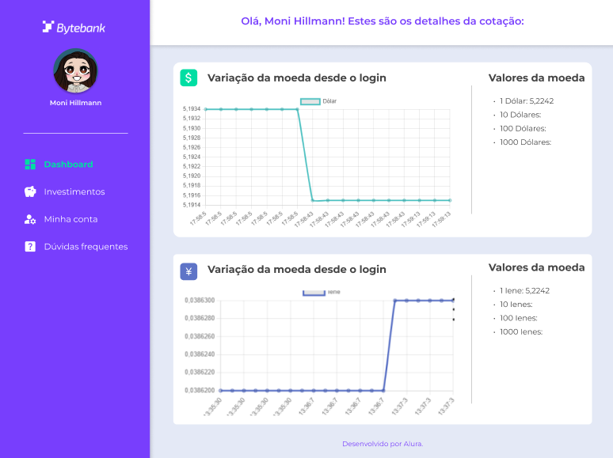

# Curso Alura JavaScript: trabalhando com threads para requisições simultâneas

## Aula 1 - Visualizando Dados

### Aula 1 - Apresentação - Vídeo 1

Transcrição  
Boas-vindas a mais um curso de JavaScript! Meu nome é Monica Hillman, mas pode me chamar de Moni Hillman. Serei sua instrutora nessa jornada de aprendizado.

Autodescrição: Sou uma mulher branca de cabelos castanhos escuros com mechas rosas. Estou usando óculos de grau e uma camiseta amarela. Ao fundo, há uma parede com iluminação azul e roxa.

Quais os pré-requisitos?  
Para conseguir acompanhar esse treinamento com mais facilidade, é importante que você já tenha noções de HTML e CSS, pois essa parte não será construída durante o projeto. Além disso, é interessante ter uma base de JavaScript, para entender melhor sobre requisições, métodos de array, laços de repetição etc.

O que vamos aprender?  
Neste curso, vamos trabalhar com a plataforma Bytebank, em que faremos parte da equipe que desenvolverá a página de cotações de moedas. No próximo vídeo, analisaremos com mais detalhes a aparência desse projeto.

Faremos a cotação de moeda em tempo real do dólar, fazendo gráficos que mostram essas alterações e variações de cotação de moedas como 1 dólar, 10 dólares, 100 dólares e assim em diante. Para praticar, aplicaremos esses conhecimentos em ienes também.

Para desenvolver essa aplicação, vamos nos aventurar com a biblioteca Chart.js, bem como o FetchAPI para nos conectar a uma API de cotação de moedas. Além disso, exploraremos conceitos como async await, setInterval() e o método Date(), nativo do JavaScript.

Estes últimos tópicos dizem respeito à assincronicidade, então vamos aproveitar para entender mais a fundo como o JavaScript lê o código, aprendendo sobre task queue, event loop e call stack.

Também estudaremos modelos de processos de leitura de código, como a de concorrência e o paralelismo. Para melhor entendimento do conceito de paralelismo, vamos compreender o que são threads, single thread e multithreads. Com os conhecimentos adquiridos nesse projeto, você aprenderá como e por que utilizar multithreads no JavaScript.

Se você se interessou por todos esses tópicos, não deixe de se matricular!

### Aula 1 - Preparando o ambiente

Olá, estudante! Desejamos boas vindas ao curso!

Aqui usaremos o editor de código chamado VSCode. Caso queira acompanhar a instrutora com as mesmas configurações, reserve um tempinho para a instalação do mesmo.

Também desenvolveremos os scripts em um projeto já construído com html e css que é a tela de cotação de moedas do ByteBank, para baixá-lo você pode acessar o [repositório do github](https://github.com/alura-cursos/bytebank-javascript/tree/main) ou [clicar aqui](https://github.com/alura-cursos/bytebank-javascript/archive/refs/heads/main.zip).

Caso tenha dúvidas durante a instalação ou no decorrer do curso, pode contar conosco criando um tópico no fórum ou interagindo no nosso servidor do Discord. Também não deixe de ajudar outros colegas. Vamos construir juntos essa grande comunidade da Alura? :)

### Aula 1 - Chart.js - Vídeo 2

Transcrição  
O Bytebank é um banco digital e estamos na equipe responsável pela página de cotação de moedas. Primeiramente, vamos abrir o [projeto no Figma](https://www.figma.com/file/WFREDPEsUmsMECg889qKyw/2480---JavaScript%3A-Concorr%C3%AAncia?node-id=33%3A283) para conferir a aparência desse projeto:



Protótipo da página de cotação de moedas. A descrição da imagem é feita nos próximos parágrafos da transcrição.

Na lateral esquerda, temos um menu sidebar na cor roxa. De cima para baixo, temos: o logotipo do Bytebank, a foto da pessoa usuária com seu nome, e as opções "Dashboard", "Investimentos", "Minha conta" e "Dúvidas frequentes". Essa estrutura é responsabilidade de outros colegas.

Eu e você ficamos responsáveis pelos blocos dispostos verticalmente na parte direita da tela, em que temos as variações da moeda desde o login. Cada bloco conta com um gráfico e com os valores da moeda, que fazem a conversão de dólares para reais (ou qualquer outra moeda desejada).

Implementando gráficos  
Para implementar um gráfico, utilizaremos a biblioteca Chart.js. No navegador, vamos acessar o [site oficial](https://www.chartjs.org/) do Chart.js e clicar no botão "Get Started" para [consultar a documentação](https://www.chartjs.org/docs/latest/).

Por que escolher a Chart.js? Entre várias bibliotecas JavaScript, ela é uma das utilizadas pela comunidade dev, contando com cerca de 60 mil likes no GitHub e 2.4 milhões de downloads semanais no npm! São muitas pessoas usando esse recurso, então garantimos melhor confiabilidade.

Na documentação, há um menu de navegação à esquerda. Atualmente, estamos na primeira seção, chamada "Chart.js". Nessa página, após o título e a frase de boas-vindas, vamos acessar o link "Get started with Chart.js".

Seremos redirecionados para a seção "Getting Started", onde vamos consultar o [tópico "Create a Chart"](https://www.chartjs.org/docs/latest/getting-started/#create-a-chart). Logo de início, temos um bloco de código. Para fazer a importação do chart, utilizaremos apenas a quarta linha desse bloco, que corresponde à tag de script com o atributo src. Vamos copiá-la:

```JavaScript
<script src="https://cdn.jsdelivr.net/npm/chart.js"></script>
```

No VS Code, vamos abrir o arquivo index.html e colá-la após o fechamento da tag `</main>`, na linha 53:

```JavaScript
<!-- código anterior omitido -->

</main>
  <script src="https://cdn.jsdelivr.net/npm/chart.js"></script>
</body>

</html>
```

Assim, o link do atributo src será: https://cdn.jsdelivr.net/npm/chart.js.

Dessa maneira, conseguimos importar o pacote CDN e teremos acesso a todas as funcionalidades dessa biblioteca, sem precisar fazer instalações em nosso computador.

No próximo vídeo, começaremos a criar nosso gráfico!

### Aula 1 - Script.js - Vídeo 3

Transcrição  
Já associamos a biblioteca Chart.js ao nosso projeto. Agora, utilizaremos as funcionalidades disponíveis nela em nosso favor.

Para descobrir como criar um gráfico, vamos voltar à documentação do Chart.js, na seção "Getting Started", no tópico "Create a Chart". Nele, temos o seguinte bloco de código:

```JavaScript
<div>
  <canvas id="myChart"></canvas>
</div>
<script src="https://cdn.jsdelivr.net/npm/chart.js"></script>
<script>
  const ctx = document.getElementById('myChart');
  new Chart(ctx, {
    type: 'bar',
    data: {
      labels: ['Red', 'Blue', 'Yellow', 'Green', 'Purple', 'Orange'],
      datasets: [{
        label: '# of Votes',
        data: [12, 19, 3, 5, 2, 3],
        borderWidth: 1
      }]
    },
    options: {
      scales: {
        y: {
          beginAtZero: true
        }
      }
    }
  });
</script>
```

Nesse trecho, vamos notar que é necessário construir um canvas (linha 2), desenvolver alguns trechos JavaScript com associação desse canvas para uma variável (linha 8) e, depois, usar um trecho de código que cria o gráfico em si.

Canvas  
Começaremos pelo canvas. Vamos copiar a segunda linha desse bloco:

```JavaScript
<canvas id="myChart"></canvas>
```

No VS Code, no arquivo index.html, vamos colá-la na linha 36, antes do fechamento da div com a classe grafico. Além disso, trocaremos o valor de seu atributo id de "myChart" para "graficoDolar":

```JavaScript
<!-- ... -->
<div class="grafico">
    <div class="grafico__titulo">
        <span class="grafico__ilustracao-dolar"></span>
        <h2>Variação da moeda desde o login</h2>
    </div>
    <canvas id="graficoDolar"></canvas>
</div>
<!-- ... -->
```

Script  
A seguir, vamos criar uma pasta. No menu "Explorer" do VS Code, clicaremos no ícone de pasta chamado "New Folder", à direita do nome do projeto. Vamos nomeá-la "script".

Com a pasta "script" selecionada, clicaremos no ícone de folha sulfite chamado "New File", também à direita do nome do projeto, para criar um arquivo chamado scripts.js.

Em scripts.js, criaremos uma constante chamada graficoDolar, que armazenará um elemento cujo ID é graficoDolar:

```JavaScript
const graficoDolar = document.getElementById('graficoDolar');
```

Voltando ao index.html, vamos adicionar a referência para esse novo script ao final do arquivo:

```JavaScript
<!-- ... -->
  </main>
  <script src="https://cdn.jsdelivr.net/npm/chart.js"></script>
  <script src="./script/scripts.js" type="module"></script>
</body>
</html>
```

Assim como na documentação, geramos um canvas, fizemos uma variável chamada graficoDolar que recebe o valor desse canvas e importamos esse novo script em index.html.

Gráfico  
Voltando ao bloco de código da documentação, falta apenas criar o gráfico, por meio do comando new Chart(). Vamos copiar o seguinte trecho:

```JavaScript
new Chart(ctx, {
    type: 'bar',
    data: {
        labels: ['Red', 'Blue', 'Yellow', 'Green', 'Purple', 'Orange'],
        datasets: [{
            label: '# of Votes',
            data: [12, 19, 3, 5, 2, 3],
            borderWidth: 1
        }]
    },
    options: {
        scales: {
            y: {
                beginAtZero: true
            }
        }
    }
});
```

No arquivo scripts.js, vamos declarar outra constante, chamada graficoParaDolar, que receberá todo o trecho copiado:

```JavaScript
const graficoDolar = document.getElementById('graficoDolar');

const graficoParaDolar = new Chart(ctx, {
    type: 'bar',
    data: {
        labels: ['Red', 'Blue', 'Yellow', 'Green', 'Purple', 'Orange'],
        datasets: [{
            label: '# of Votes',
            data: [12, 19, 3, 5, 2, 3],
            borderWidth: 1
        }]
    },
    options: {
        scales: {
            y: {
                beginAtZero: true
            }
        }
    }
});
```

Vamos remover os options, da linha 13 a 19:

```JavaScript
const graficoDolar = document.getElementById('graficoDolar');

const graficoParaDolar = new Chart(ctx, {
    type: 'bar',
    data: {
        labels: ['Red', 'Blue', 'Yellow', 'Green', 'Purple', 'Orange'],
        datasets: [{
            label: '# of Votes',
            data: [12, 19, 3, 5, 2, 3],
            borderWidth: 1
        }]
    },
});
```

O primeiro parâmetro de new Chart() refere-se à variável que faz a conexão com o canvas. No caso, nossa variável chama-se graficoDolar, então vamos substituir ctx por graficoDolar, na linha 3:

```JavaScript
const graficoDolar = document.getElementById('graficoDolar');

const graficoParaDolar = new Chart(graficoDolar, {
    type: 'bar',
    data: {
        labels: ['Red', 'Blue', 'Yellow', 'Green', 'Purple', 'Orange'],
        datasets: [{
            label: '# of Votes',
            data: [12, 19, 3, 5, 2, 3],
            borderWidth: 1
        }]
    },
});
```

O segundo parâmetro de new Chart() é uma lista de configurações. Em type, temos o tipo do gráfico, atualmente em barras. Vamos trocar de bar para line para obter um gráfico de linhas:

```JavaScript
const graficoDolar = document.getElementById('graficoDolar');

const graficoParaDolar = new Chart(graficoDolar, {
    type: 'line',
    data: {
        labels: ['Red', 'Blue', 'Yellow', 'Green', 'Purple', 'Orange'],
        datasets: [{
            label: '# of Votes',
            data: [12, 19, 3, 5, 2, 3],
            borderWidth: 1
        }]
    },
});
```

Em data, temos os dados que serão exibidos no gráfico. Nas legendas (labels), temos diversas cores. Nos dados em si (datasets), temos números de votos. Como ainda não temos dados, vamos manter do jeito que está na documentação.

Já podemos abrir um servidor local para conferir se nosso código está funcionando. No canto inferior direito do VS Code, vamos clicar no botão "Go live", por meio da extensão Live Server.

No navegador, já é possível visualizar o gráfico com algumas informações genéricas. Conseguimos implementar um gráfico visualmente bonito. No próximo vídeo, vamos aprender como tornar esses dados dinâmicos, consumindo uma API.

### Aula 1 - Para saber mais: documentação da biblioteca

Entre muitas bibliotecas de gráficos para desenvolvedores de aplicativos JavaScript, Chart.js é atualmente a mais popular de acordo com as estrelas do GitHub (60.000) e downloads (2.400.000 semanais).

O Chart.js foi criado e anunciado em 2013. É de código aberto, sob a licença muito permissiva do MIT e mantido por uma comunidade ativa. Além de tudo isso, é compatível com todas as estruturas JavaScript populares, incluindo React, Vue, Svelte e Angular, ou seja, você pode usar em seus projetos pessoais também!

E por isso indico a consulta na documentação da biblioteca, caso você queira customizar os seus gráficos do ByteBank ou também de outros projetos. [Clique aqui](https://www.chartjs.org/docs/latest/) para saber mais da biblioteca.

### Aula 1 - Gráficos - Exercício

Através do comando new Chart() conseguimos instanciar um novo gráfico com o auxílio da biblioteca Chart.js. Quais parâmetros devem ser inseridos dentro dos parênteses para completar essa ação?

Alternativa correta  
Uma variável referente ao elemento canvas e um objeto com configurações do gráfico.

> Isso ai! Primeiro é definido onde o gráfico será instanciado e depois enviamos um objeto com as propriedades de tipo, dados e etc. que servem como configuração.

### Aula 1 - FetchAPI - Vídeo 4

Transcrição  
Para tornar esse gráfico dinâmico, precisamos receber os valores de algum local externo. Então, vamos pesquisar por "api de cotação de moedas" no Google e acessar na [documentação da AwesomeAPI](https://docs.awesomeapi.com.br/api-de-moedas).

Essa API conta com mais de 150 moedas diferentes! Além disso, temos um link que é atualizado a cada 30 segundos com a cotação em tempo real. Essa API é ideal para o nosso projeto.

O que é uma API?  
Uma API é uma interface de Programação de Aplicações, que são mecanismos que permitem que dois componentes de software se comuniquem usando um conjunto de definições e protocolos.

Para entender melhor, vamos imaginar três elementos: o cliente, a API e o servidor:

[Diagrama de arquitetura da API. À esquerda, o cliente é representado por um monitor com um ícone de usuário. No centro, a API é representada por uma nuvem com um ícone de engrenagem. À direita, o servidor é representado por um banco de dados (três retângulos empilhados).]

Quando pedimos ao site algo que precisamos pegar externamente (como a cotação da moeda), enviamos uma solicitação para a API, que solicitará dados para o servidor (back-end). O servidor retornará o valor para a API, que depois enviará o resultado pronto para nós, no front-end. Ou seja, a API serve como intermediário, fazendo a ponte entre o cliente e o servidor:

[Mesmo diagrama de arquitetura da API. Agora, há quatro setas. A primeira seta aponta do cliente até a API. A segunda seta aponta da API até o servidor e é denominada "Solicitação". A terceira seta aponta do servidor até a API. A última seta aponta da API até o cliente e é denominada "Resposta".]

A seguir, colocaremos esse conceito na prática. Na documentação da AwesomeAPI, vamos copiar o primeiro link de moedas selecionadas:

```JavaScript
https://economia.awesomeapi.com.br/json/last/:moedas
```

No VS Code, vamos abrir o script.js. Ao final do arquivo, criaremos uma função assíncrona chamada conectaAPI(). Nela, declararemos a constante conecta, que armazenará o retorno do fetch() cujo parâmetro será o link copiado:

```JavaScript
// ...
async function conectaAPI() {
    const conecta = await fetch("https://economia.awesomeapi.com.br/json/last/:moedas");
}
```

No final desse link, vamos substituir :moedas por USD-BRL:

```JavaScript
// ...
async function conectaAPI() {
    const conecta = await fetch("https://economia.awesomeapi.com.br/json/last/USD-BRL");
}
```

Em seguida, vamos declarar a constante conectaTraduzido, que receberá await conecta.json():

```JavaScript
// ...
async function conectaAPI() {
    const conecta = await fetch("https://economia.awesomeapi.com.br/json/last/USD-BRL");
    const conectaTraduzido = await conecta.json();
}
```

Por fim, vamos usar um console.log() para exibir conectaTraduzido. Após a declaração da função, vamos chamá-la:

```JavaScript
// ...
async function conectaAPI() {
    const conecta = await fetch("https://economia.awesomeapi.com.br/json/last/USD-BRL");
    const conectaTraduzido = await conecta.json();
    console.log(conectaTraduzido);
}
conectaAPI();
```

Na sequência, vamos checar nosso servidor local para saber o que será retornado no console. No navegador, pressionaremos a tecla "F12" e acessaremos a aba "Console". Como retorno, teremos um objeto com o valores da conversão entre USD e BRL. Por exemplo:

```JavaScript
USDBRL:
    ask: "5.2205"
    bid: "5.2175"
    code: "USD"
    codein: "BRL"
    create_date: "2022-12-26 17:46:53"
    high: "5.2198"
    low: "5.1572"
    name: "Dólar Americano/Real Brasileiro"
    pctChange: "1.04"
    timestamp: "1672887613"
    varBid: "0.0538"
```

Nesse caso, 1 dólar está valendo 5,22 reais. Já estamos conseguindo fazer a associação.

Eu resumo, construímos uma requisição do tipo GET para uma API. Como não sabemos se o retorno será rápido ou demorado, transformamos essa função em assíncrona. Desse modo, conseguimos esperar o retorno sem travar o restante do código.

Assim, temos uma conexão com uma biblioteca externa chamada Chart.js e uma requisição a uma API de cotação de moedas. Já conseguimos nos conectar com todos os recursos externos necessários para desenvolver nosso projeto.

Na próxima aula, exploraremos mais a fundo como funciona a leitura de um código JavaScript e aprender como captar a hora e a data de quando uma requisição está sendo realizada, por meio de recursos nativos do JavaScript.

### Aula 1 - Nessa aula, você aprendeu como:

- Instalar a biblioteca Chart.js via CDN;
- Implementar um gráfico com os métodos disponíveis na biblioteca Chart.js;
- Consumir APIs de forma assíncrona com a FetchAPI;
- Conectar com a API de cotação de moedas chamada Awesome API.

## Aula 2 - Aplicando a assincronicidade

### Aula 2 - setInterval - Vídeo 1

Transcrição  
Se analisarmos a nossa página, veremos na seção Dashboard um gráfico com o título "Variação da moeda desde o login". A partir dele, entendemos que a requisição acontecerá várias vezes durante o acesso da pessoa usuária. Como faremos a requisição ocorrer mais de uma vez?

Voltaremos ao VS Code, onde acessaremos o interior do arquivo script.js. Abaixo da function conectaAPI() encontraremos a linha em que chamamos a conectaAPI(). Vamos apagar chamada e substituí-la por um setInterval(), que receberá entre parênteses a função () => conectaAPI() e o valor 5000, ambos separados por vírgula.

```JavaScript
async function conectaAPI() {

// Código omitido

}

setInterval(() => conectaAPI(), 5000)
```
a
Retornaremos ao nosso servidor local, onde abriremos a aba do console pressionando "F12". Nele podemos ver que a cada 5 segundos temos o retorno abaixo.

{USDBRL: {…}}

Isso significa que, a cada 5 segundos, uma requisição será feita.

Qual a função do setInterval()? Ele define um intervalo para algo acontecer, recebendo como parâmetro uma ação — neste caso, a chamada da API — junto ao tempo de duração de cada ciclo em milissegundos — neste caso, 5000 milissegundos que é equivalente à 5 segundos.

O que aconteceria se colocássemos mais elementos após o setInterval()? O código travaria com ciclos infinitos a cada 5 segundos?

A seguir, entenderemos como funciona a leitura do Javascript e como funciona a assincronicidade que vimos anteriormente. Uniremos estes conceitos para entender o funcionamento desta linguagem de programação. Até o próximo vídeo.

### Aula 2 - Execução do código - Exercício

Observe o trecho de código a seguir:

```JavaScript
setTimeOut(interageUsuario, 5000)
console.log(“Hello, World!”)

function interageUsuario() {
console.log(“Boas vindas ao meu código!")
}

console.log(“Meu nome é Moni!”)
```

Sabendo que o método setTimeOut chama uma função após alguns milissegundos, o que será impresso no console?

Resposta:

- Hello, World!
- Meu nome é Moni!
- Boas vindas ao meu código!

> Apesar da função ser chamada na primeira linha, ela demora alguns segundos para ser executada e esse tempo é o suficiente para realizar a leitura dos outros console.log.

### Aula 2 - Event Loop - Vídeo 2

Transcrição  
Chamamos a conectaAPI depois da construção da função. Faz sentido, já que não podemos chamar algo que ainda não foi construído.

Mesmo assim, testaremos essa lógica: vamos chamar a conectaAPI() antes da sua declaração. Para isso, retornaremos ao VS Code, no arquivo scripts.js. Em seu interior, recortaremos a linha setInterval(() => conectaAPI(), 5000) e a colaremos acima da async function conectaAPI()

```JavaScript
setInterval(() => conectaAPI(), 5000)
async function conectaAPI() {

// Código omitido

}
```

Retornaremos ao servidor local, onde abriremos o console com o "F12". Nele veremos que as requisições ocorrem normalmente.

Por que isso ocorre? Para conseguirmos a resposta precisamos entender como o Javascript lê o código.

O Javascript consegue ler as tarefas e executá-las em ordem diferente. Isto é o que chamamos de Modelo de concorrência. No Javascript, este modelo é baseado em um Event Loop (ou Laço de Eventos) que empilha e determina a ordem de execução das tarefas, empilhando-as.

Assim como criamos o setInterval() que roda um comando várias vezes em um determinado intervalo de tempo, criamos também uma função assíncrona para a requisição da API.

Para onde vão esses comandos que demoram um pouco mais para acontecer? Eles travam o código?

Na verdade, eles vão para um local chamado Task Queue (ou Fila de Tarefas).

Podemos separar a execução do código Javascript em três etapas: Task Queue, Event Loop e Call Stack (ou Pilha de Chamadas).

O Event Loop passa pelo código, empilhando dentro da Call Stack os comandos a serem executados. Estes, por sua vez, serão executados um por vez. Quando o Event Loop detecta que algum comando demorará para acontecer, ele o envia para a Task Queue, onde este ficará em modo de espera. No momento de sua ativação, o comando voltará para a Call Stack.

Com isso, podemos determinar que as ações não ocorrem simultaneamente, mas sim em uma ordem definida pelo Event Loop — mesmo que não seja a ordem escrita no nosso código.

Agora que entendemos um pouco do que acontece em nosso código, daremos andamento no projeto e realizaremos outras etapas. A próxima etapa será determinar a hora e a data da requisição para inserir estes dados futuramente no gráfico.

Até o próximo vídeo.

### Aula 2 - Para saber mais: leitura de código

O JavaScript possui um modelo de concorrência baseado em um event loop (laço de eventos, em português), responsável pela execução do código, coleta e processamento de eventos e execução de subtarefas enfileiradas.

Apesar de executar tarefas em ordens diferentes, por padrão o JavaScript funciona de modo síncrono, onde o event loop executa as tarefas que ficam na call stack linha a linha. Algumas funções podem demorar para executar ou possuem um tempo especificado para acontecer, e pra isso temos o auxílio da task queue para não impedir a leitura do código, tornando o código assíncrono.

Abaixo você pode conferir um glossário com a explicação de cada um desses termos técnicos citados:

Termo - Significado  
Concorrência - Um programa é concorrente quando é composto de tarefas que podem ser executadas em ordens diferentes.
Event Loop - É um ciclo que monitora e executa as ações que mandamos para o JavaScript. O processo de leitura do código só é finalizado quando não existem mais ações a serem executadas.
Task Queue - A fila de tarefas assíncronas.
Call Stack - É um mecanismo que organiza como irá funcionar o script quando existem muitas funções: qual função está sendo executada, quais estão sendo chamadas dentro de alguma função, etc.

Você pode descobrir mais sobre assincronicidade no Javascript com o [curso JavaScript: consumindo e tratando dados de uma API](https://cursos.alura.com.br/course/javascript-consumindo-tratando-dados-api), ministrado pela Rafaela Silvério, onde aprendemos passo a passo de como consumir uma API, nos aventurando por vários termos técnicos que nos ajudam entender como as requisições funcionam.

### Aula 2 - Obejeto Date - Vídeo 3

Transcrição  
Se abrirmos o Figma do projeto veremos que o gráfico é composto de duas informações: o valor da cotação da moeda e a hora em que a cotação foi retornada.

Voltaremos ao arquivo scripts.js aberto no VS Code. Para trabalharmos com datas e horários, criaremos no final desse arquivo a função geraHorario() com H maiúsculo, seguido de um bloco de chaves, cujo interior receberá um let data = new Date() e um console.log(data) ambos em linhas separadas.

Abaixo das chaves, chamaremos a função recém-criada.

```JavaScript
function geraHorario() {
    let data = new Date();
    console.log(data)
}
geraHorario();
```

Salvaremos o código e retornaremos ao navegador, onde abriremos novamente o console e veremos um retorno com o dia da semana, o mês, o dia, o ano e o horário. Sempre que houver a necessidade de recuperar a data do projeto, podemos contar com o new Date().

Neste projeto, precisamos somente do horário. Voltando ao VS Code, removeremos o console.log(data) e em seu lugar adicionaremos um let horario = data.getHours() + ":" + data.getMinutes() + ":" + data.getSeconds().

Abaixo dessa linha daremos um console.log(horario). Abaixo deste, por sua vez, adicionaremos um return horario, já que precisaremos desse valor quando chamarmos a função.

```JavaScript
function geraHorario() {
    let data = new Date();
    let horario = data.getHours() + ":" + data.getMinutes() + ":" + data.getSeconds();
    console.log(horario);
    return horario;
}

geraHorario();
```

Voltaremos ao navegador para ver se isso funcionou. Agora vemos no console somente o horário no formato que configuramos: "horas:minutos:segundos".

Já temos as informações da requisição recuperadas e a informação da hora. Ou seja, temos todos os valores necessários para incluir e alimentar o gráfico.

Na próxima aula, chegaremos na etapa de inclusão dos valores. Até logo!

### Aula 2 - O que aprendemos?

Nessa aula, você aprendeu como:

- Executar uma função a cada determinado tempo através do setInterval;
- Identificar o modelo de concorrência;
- Compreender a execução do código JavaScript;
- Distinguir os papéis do Event Loop, Call Stack e Task Queue;
- Capturar datas e horas com o objeto Date.

## Aula 3 - 

### Aula 3 -  - Vídeo 6
