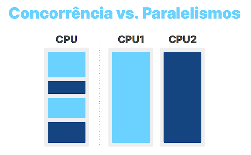

# Curso Alura JavaScript: trabalhando com threads para requisições simultâneas

## Aula 1 - Visualizando Dados

### Aula 1 - Apresentação - Vídeo 1

Transcrição  
Boas-vindas a mais um curso de JavaScript! Meu nome é Monica Hillman, mas pode me chamar de Moni Hillman. Serei sua instrutora nessa jornada de aprendizado.

Autodescrição: Sou uma mulher branca de cabelos castanhos escuros com mechas rosas. Estou usando óculos de grau e uma camiseta amarela. Ao fundo, há uma parede com iluminação azul e roxa.

Quais os pré-requisitos?  
Para conseguir acompanhar esse treinamento com mais facilidade, é importante que você já tenha noções de HTML e CSS, pois essa parte não será construída durante o projeto. Além disso, é interessante ter uma base de JavaScript, para entender melhor sobre requisições, métodos de array, laços de repetição etc.

O que vamos aprender?  
Neste curso, vamos trabalhar com a plataforma Bytebank, em que faremos parte da equipe que desenvolverá a página de cotações de moedas. No próximo vídeo, analisaremos com mais detalhes a aparência desse projeto.

Faremos a cotação de moeda em tempo real do dólar, fazendo gráficos que mostram essas alterações e variações de cotação de moedas como 1 dólar, 10 dólares, 100 dólares e assim em diante. Para praticar, aplicaremos esses conhecimentos em ienes também.

Para desenvolver essa aplicação, vamos nos aventurar com a biblioteca Chart.js, bem como o FetchAPI para nos conectar a uma API de cotação de moedas. Além disso, exploraremos conceitos como async await, setInterval() e o método Date(), nativo do JavaScript.

Estes últimos tópicos dizem respeito à assincronicidade, então vamos aproveitar para entender mais a fundo como o JavaScript lê o código, aprendendo sobre task queue, event loop e call stack.

Também estudaremos modelos de processos de leitura de código, como a de concorrência e o paralelismo. Para melhor entendimento do conceito de paralelismo, vamos compreender o que são threads, single thread e multithreads. Com os conhecimentos adquiridos nesse projeto, você aprenderá como e por que utilizar multithreads no JavaScript.

Se você se interessou por todos esses tópicos, não deixe de se matricular!

### Aula 1 - Preparando o ambiente

Olá, estudante! Desejamos boas vindas ao curso!

Aqui usaremos o editor de código chamado VSCode. Caso queira acompanhar a instrutora com as mesmas configurações, reserve um tempinho para a instalação do mesmo.

Também desenvolveremos os scripts em um projeto já construído com html e css que é a tela de cotação de moedas do ByteBank, para baixá-lo você pode acessar o [repositório do github](https://github.com/alura-cursos/bytebank-javascript/tree/main) ou [clicar aqui](https://github.com/alura-cursos/bytebank-javascript/archive/refs/heads/main.zip).

Caso tenha dúvidas durante a instalação ou no decorrer do curso, pode contar conosco criando um tópico no fórum ou interagindo no nosso servidor do Discord. Também não deixe de ajudar outros colegas. Vamos construir juntos essa grande comunidade da Alura? :)

### Aula 1 - Chart.js - Vídeo 2

Transcrição  
O Bytebank é um banco digital e estamos na equipe responsável pela página de cotação de moedas. Primeiramente, vamos abrir o [projeto no Figma](https://www.figma.com/file/WFREDPEsUmsMECg889qKyw/2480---JavaScript%3A-Concorr%C3%AAncia?node-id=33%3A283) para conferir a aparência desse projeto:


Protótipo da página de cotação de moedas. A descrição da imagem é feita nos próximos parágrafos da transcrição.

Na lateral esquerda, temos um menu sidebar na cor roxa. De cima para baixo, temos: o logotipo do Bytebank, a foto da pessoa usuária com seu nome, e as opções "Dashboard", "Investimentos", "Minha conta" e "Dúvidas frequentes". Essa estrutura é responsabilidade de outros colegas.

Eu e você ficamos responsáveis pelos blocos dispostos verticalmente na parte direita da tela, em que temos as variações da moeda desde o login. Cada bloco conta com um gráfico e com os valores da moeda, que fazem a conversão de dólares para reais (ou qualquer outra moeda desejada).

Implementando gráficos  
Para implementar um gráfico, utilizaremos a biblioteca Chart.js. No navegador, vamos acessar o [site oficial](https://www.chartjs.org/) do Chart.js e clicar no botão "Get Started" para [consultar a documentação](https://www.chartjs.org/docs/latest/).

Por que escolher a Chart.js? Entre várias bibliotecas JavaScript, ela é uma das utilizadas pela comunidade dev, contando com cerca de 60 mil likes no GitHub e 2.4 milhões de downloads semanais no npm! São muitas pessoas usando esse recurso, então garantimos melhor confiabilidade.

Na documentação, há um menu de navegação à esquerda. Atualmente, estamos na primeira seção, chamada "Chart.js". Nessa página, após o título e a frase de boas-vindas, vamos acessar o link "Get started with Chart.js".

Seremos redirecionados para a seção "Getting Started", onde vamos consultar o [tópico "Create a Chart"](https://www.chartjs.org/docs/latest/getting-started/#create-a-chart). Logo de início, temos um bloco de código. Para fazer a importação do chart, utilizaremos apenas a quarta linha desse bloco, que corresponde à tag de script com o atributo src. Vamos copiá-la:

```JavaScript
<script src="https://cdn.jsdelivr.net/npm/chart.js"></script>
```

No VS Code, vamos abrir o arquivo index.html e colá-la após o fechamento da tag `</main>`, na linha 53:

```JavaScript
<!-- código anterior omitido -->

</main>
  <script src="https://cdn.jsdelivr.net/npm/chart.js"></script>
</body>

</html>
```

Assim, o link do atributo src será: https://cdn.jsdelivr.net/npm/chart.js.

Dessa maneira, conseguimos importar o pacote CDN e teremos acesso a todas as funcionalidades dessa biblioteca, sem precisar fazer instalações em nosso computador.

No próximo vídeo, começaremos a criar nosso gráfico!

### Aula 1 - Script.js - Vídeo 3

Transcrição  
Já associamos a biblioteca Chart.js ao nosso projeto. Agora, utilizaremos as funcionalidades disponíveis nela em nosso favor.

Para descobrir como criar um gráfico, vamos voltar à documentação do Chart.js, na seção "Getting Started", no tópico "Create a Chart". Nele, temos o seguinte bloco de código:

```JavaScript
<div>
  <canvas id="myChart"></canvas>
</div>
<script src="https://cdn.jsdelivr.net/npm/chart.js"></script>
<script>
  const ctx = document.getElementById('myChart');
  new Chart(ctx, {
    type: 'bar',
    data: {
      labels: ['Red', 'Blue', 'Yellow', 'Green', 'Purple', 'Orange'],
      datasets: [{
        label: '# of Votes',
        data: [12, 19, 3, 5, 2, 3],
        borderWidth: 1
      }]
    },
    options: {
      scales: {
        y: {
          beginAtZero: true
        }
      }
    }
  });
</script>
```

Nesse trecho, vamos notar que é necessário construir um canvas (linha 2), desenvolver alguns trechos JavaScript com associação desse canvas para uma variável (linha 8) e, depois, usar um trecho de código que cria o gráfico em si.

Canvas  
Começaremos pelo canvas. Vamos copiar a segunda linha desse bloco:

```JavaScript
<canvas id="myChart"></canvas>
```

No VS Code, no arquivo index.html, vamos colá-la na linha 36, antes do fechamento da div com a classe grafico. Além disso, trocaremos o valor de seu atributo id de "myChart" para "graficoDolar":

```JavaScript
<!-- ... -->
<div class="grafico">
    <div class="grafico__titulo">
        <span class="grafico__ilustracao-dolar"></span>
        <h2>Variação da moeda desde o login</h2>
    </div>
    <canvas id="graficoDolar"></canvas>
</div>
<!-- ... -->
```

Script  
A seguir, vamos criar uma pasta. No menu "Explorer" do VS Code, clicaremos no ícone de pasta chamado "New Folder", à direita do nome do projeto. Vamos nomeá-la "script".

Com a pasta "script" selecionada, clicaremos no ícone de folha sulfite chamado "New File", também à direita do nome do projeto, para criar um arquivo chamado scripts.js.

Em scripts.js, criaremos uma constante chamada graficoDolar, que armazenará um elemento cujo ID é graficoDolar:

```JavaScript
const graficoDolar = document.getElementById('graficoDolar');
```

Voltando ao index.html, vamos adicionar a referência para esse novo script ao final do arquivo:

```JavaScript
<!-- ... -->
  </main>
  <script src="https://cdn.jsdelivr.net/npm/chart.js"></script>
  <script src="./script/scripts.js" type="module"></script>
</body>
</html>
```

Assim como na documentação, geramos um canvas, fizemos uma variável chamada graficoDolar que recebe o valor desse canvas e importamos esse novo script em index.html.

Gráfico  
Voltando ao bloco de código da documentação, falta apenas criar o gráfico, por meio do comando new Chart(). Vamos copiar o seguinte trecho:

```JavaScript
new Chart(ctx, {
    type: 'bar',
    data: {
        labels: ['Red', 'Blue', 'Yellow', 'Green', 'Purple', 'Orange'],
        datasets: [{
            label: '# of Votes',
            data: [12, 19, 3, 5, 2, 3],
            borderWidth: 1
        }]
    },
    options: {
        scales: {
            y: {
                beginAtZero: true
            }
        }
    }
});
```

No arquivo scripts.js, vamos declarar outra constante, chamada graficoParaDolar, que receberá todo o trecho copiado:

```JavaScript
const graficoDolar = document.getElementById('graficoDolar');

const graficoParaDolar = new Chart(ctx, {
    type: 'bar',
    data: {
        labels: ['Red', 'Blue', 'Yellow', 'Green', 'Purple', 'Orange'],
        datasets: [{
            label: '# of Votes',
            data: [12, 19, 3, 5, 2, 3],
            borderWidth: 1
        }]
    },
    options: {
        scales: {
            y: {
                beginAtZero: true
            }
        }
    }
});
```

Vamos remover os options, da linha 13 a 19:

```JavaScript
const graficoDolar = document.getElementById('graficoDolar');

const graficoParaDolar = new Chart(ctx, {
    type: 'bar',
    data: {
        labels: ['Red', 'Blue', 'Yellow', 'Green', 'Purple', 'Orange'],
        datasets: [{
            label: '# of Votes',
            data: [12, 19, 3, 5, 2, 3],
            borderWidth: 1
        }]
    },
});
```

O primeiro parâmetro de new Chart() refere-se à variável que faz a conexão com o canvas. No caso, nossa variável chama-se graficoDolar, então vamos substituir ctx por graficoDolar, na linha 3:

```JavaScript
const graficoDolar = document.getElementById('graficoDolar');

const graficoParaDolar = new Chart(graficoDolar, {
    type: 'bar',
    data: {
        labels: ['Red', 'Blue', 'Yellow', 'Green', 'Purple', 'Orange'],
        datasets: [{
            label: '# of Votes',
            data: [12, 19, 3, 5, 2, 3],
            borderWidth: 1
        }]
    },
});
```

O segundo parâmetro de new Chart() é uma lista de configurações. Em type, temos o tipo do gráfico, atualmente em barras. Vamos trocar de bar para line para obter um gráfico de linhas:

```JavaScript
const graficoDolar = document.getElementById('graficoDolar');

const graficoParaDolar = new Chart(graficoDolar, {
    type: 'line',
    data: {
        labels: ['Red', 'Blue', 'Yellow', 'Green', 'Purple', 'Orange'],
        datasets: [{
            label: '# of Votes',
            data: [12, 19, 3, 5, 2, 3],
            borderWidth: 1
        }]
    },
});
```

Em data, temos os dados que serão exibidos no gráfico. Nas legendas (labels), temos diversas cores. Nos dados em si (datasets), temos números de votos. Como ainda não temos dados, vamos manter do jeito que está na documentação.

Já podemos abrir um servidor local para conferir se nosso código está funcionando. No canto inferior direito do VS Code, vamos clicar no botão "Go live", por meio da extensão Live Server.

No navegador, já é possível visualizar o gráfico com algumas informações genéricas. Conseguimos implementar um gráfico visualmente bonito. No próximo vídeo, vamos aprender como tornar esses dados dinâmicos, consumindo uma API.

### Aula 1 - Para saber mais: documentação da biblioteca

Entre muitas bibliotecas de gráficos para desenvolvedores de aplicativos JavaScript, Chart.js é atualmente a mais popular de acordo com as estrelas do GitHub (60.000) e downloads (2.400.000 semanais).

O Chart.js foi criado e anunciado em 2013. É de código aberto, sob a licença muito permissiva do MIT e mantido por uma comunidade ativa. Além de tudo isso, é compatível com todas as estruturas JavaScript populares, incluindo React, Vue, Svelte e Angular, ou seja, você pode usar em seus projetos pessoais também!

E por isso indico a consulta na documentação da biblioteca, caso você queira customizar os seus gráficos do ByteBank ou também de outros projetos. [Clique aqui](https://www.chartjs.org/docs/latest/) para saber mais da biblioteca.

### Aula 1 - Gráficos - Exercício

Através do comando new Chart() conseguimos instanciar um novo gráfico com o auxílio da biblioteca Chart.js. Quais parâmetros devem ser inseridos dentro dos parênteses para completar essa ação?

Alternativa correta  
Uma variável referente ao elemento canvas e um objeto com configurações do gráfico.

> Isso ai! Primeiro é definido onde o gráfico será instanciado e depois enviamos um objeto com as propriedades de tipo, dados e etc. que servem como configuração.

### Aula 1 - FetchAPI - Vídeo 4

Transcrição  
Para tornar esse gráfico dinâmico, precisamos receber os valores de algum local externo. Então, vamos pesquisar por "api de cotação de moedas" no Google e acessar na [documentação da AwesomeAPI](https://docs.awesomeapi.com.br/api-de-moedas).

Essa API conta com mais de 150 moedas diferentes! Além disso, temos um link que é atualizado a cada 30 segundos com a cotação em tempo real. Essa API é ideal para o nosso projeto.

O que é uma API?  
Uma API é uma interface de Programação de Aplicações, que são mecanismos que permitem que dois componentes de software se comuniquem usando um conjunto de definições e protocolos.

Para entender melhor, vamos imaginar três elementos: o cliente, a API e o servidor:

[Diagrama de arquitetura da API. À esquerda, o cliente é representado por um monitor com um ícone de usuário. No centro, a API é representada por uma nuvem com um ícone de engrenagem. À direita, o servidor é representado por um banco de dados (três retângulos empilhados).]

Quando pedimos ao site algo que precisamos pegar externamente (como a cotação da moeda), enviamos uma solicitação para a API, que solicitará dados para o servidor (back-end). O servidor retornará o valor para a API, que depois enviará o resultado pronto para nós, no front-end. Ou seja, a API serve como intermediário, fazendo a ponte entre o cliente e o servidor:

[Mesmo diagrama de arquitetura da API. Agora, há quatro setas. A primeira seta aponta do cliente até a API. A segunda seta aponta da API até o servidor e é denominada "Solicitação". A terceira seta aponta do servidor até a API. A última seta aponta da API até o cliente e é denominada "Resposta".]

A seguir, colocaremos esse conceito na prática. Na documentação da AwesomeAPI, vamos copiar o primeiro link de moedas selecionadas:

```JavaScript
https://economia.awesomeapi.com.br/json/last/:moedas
```

No VS Code, vamos abrir o script.js. Ao final do arquivo, criaremos uma função assíncrona chamada conectaAPI(). Nela, declararemos a constante conecta, que armazenará o retorno do fetch() cujo parâmetro será o link copiado:

```JavaScript
// ...
async function conectaAPI() {
    const conecta = await fetch("https://economia.awesomeapi.com.br/json/last/:moedas");
}
```

No final desse link, vamos substituir :moedas por USD-BRL:

```JavaScript
// ...
async function conectaAPI() {
    const conecta = await fetch("https://economia.awesomeapi.com.br/json/last/USD-BRL");
}
```

Em seguida, vamos declarar a constante conectaTraduzido, que receberá await conecta.json():

```JavaScript
// ...
async function conectaAPI() {
    const conecta = await fetch("https://economia.awesomeapi.com.br/json/last/USD-BRL");
    const conectaTraduzido = await conecta.json();
}
```

Por fim, vamos usar um console.log() para exibir conectaTraduzido. Após a declaração da função, vamos chamá-la:

```JavaScript
// ...
async function conectaAPI() {
    const conecta = await fetch("https://economia.awesomeapi.com.br/json/last/USD-BRL");
    const conectaTraduzido = await conecta.json();
    console.log(conectaTraduzido);
}
conectaAPI();
```

Na sequência, vamos checar nosso servidor local para saber o que será retornado no console. No navegador, pressionaremos a tecla "F12" e acessaremos a aba "Console". Como retorno, teremos um objeto com o valores da conversão entre USD e BRL. Por exemplo:

```JavaScript
USDBRL:
    ask: "5.2205"
    bid: "5.2175"
    code: "USD"
    codein: "BRL"
    create_date: "2022-12-26 17:46:53"
    high: "5.2198"
    low: "5.1572"
    name: "Dólar Americano/Real Brasileiro"
    pctChange: "1.04"
    timestamp: "1672887613"
    varBid: "0.0538"
```

Nesse caso, 1 dólar está valendo 5,22 reais. Já estamos conseguindo fazer a associação.

Eu resumo, construímos uma requisição do tipo GET para uma API. Como não sabemos se o retorno será rápido ou demorado, transformamos essa função em assíncrona. Desse modo, conseguimos esperar o retorno sem travar o restante do código.

Assim, temos uma conexão com uma biblioteca externa chamada Chart.js e uma requisição a uma API de cotação de moedas. Já conseguimos nos conectar com todos os recursos externos necessários para desenvolver nosso projeto.

Na próxima aula, exploraremos mais a fundo como funciona a leitura de um código JavaScript e aprender como captar a hora e a data de quando uma requisição está sendo realizada, por meio de recursos nativos do JavaScript.

### Aula 1 - Nessa aula, você aprendeu como:

- Instalar a biblioteca Chart.js via CDN;
- Implementar um gráfico com os métodos disponíveis na biblioteca Chart.js;
- Consumir APIs de forma assíncrona com a FetchAPI;
- Conectar com a API de cotação de moedas chamada Awesome API.

## Aula 2 - Aplicando a assincronicidade

### Aula 2 - setInterval - Vídeo 1

Transcrição  
Se analisarmos a nossa página, veremos na seção Dashboard um gráfico com o título "Variação da moeda desde o login". A partir dele, entendemos que a requisição acontecerá várias vezes durante o acesso da pessoa usuária. Como faremos a requisição ocorrer mais de uma vez?

Voltaremos ao VS Code, onde acessaremos o interior do arquivo script.js. Abaixo da function conectaAPI() encontraremos a linha em que chamamos a conectaAPI(). Vamos apagar chamada e substituí-la por um setInterval(), que receberá entre parênteses a função () => conectaAPI() e o valor 5000, ambos separados por vírgula.

```JavaScript
async function conectaAPI() {

// Código omitido

}

setInterval(() => conectaAPI(), 5000)
```
a
Retornaremos ao nosso servidor local, onde abriremos a aba do console pressionando "F12". Nele podemos ver que a cada 5 segundos temos o retorno abaixo.

{USDBRL: {…}}

Isso significa que, a cada 5 segundos, uma requisição será feita.

Qual a função do setInterval()? Ele define um intervalo para algo acontecer, recebendo como parâmetro uma ação — neste caso, a chamada da API — junto ao tempo de duração de cada ciclo em milissegundos — neste caso, 5000 milissegundos que é equivalente à 5 segundos.

O que aconteceria se colocássemos mais elementos após o setInterval()? O código travaria com ciclos infinitos a cada 5 segundos?

A seguir, entenderemos como funciona a leitura do Javascript e como funciona a assincronicidade que vimos anteriormente. Uniremos estes conceitos para entender o funcionamento desta linguagem de programação. Até o próximo vídeo.

### Aula 2 - Execução do código - Exercício

Observe o trecho de código a seguir:

```JavaScript
setTimeOut(interageUsuario, 5000)
console.log(“Hello, World!”)

function interageUsuario() {
console.log(“Boas vindas ao meu código!")
}

console.log(“Meu nome é Moni!”)
```

Sabendo que o método setTimeOut chama uma função após alguns milissegundos, o que será impresso no console?

Resposta:

- Hello, World!
- Meu nome é Moni!
- Boas vindas ao meu código!

> Apesar da função ser chamada na primeira linha, ela demora alguns segundos para ser executada e esse tempo é o suficiente para realizar a leitura dos outros console.log.

### Aula 2 - Event Loop - Vídeo 2

Transcrição  
Chamamos a conectaAPI depois da construção da função. Faz sentido, já que não podemos chamar algo que ainda não foi construído.

Mesmo assim, testaremos essa lógica: vamos chamar a conectaAPI() antes da sua declaração. Para isso, retornaremos ao VS Code, no arquivo scripts.js. Em seu interior, recortaremos a linha setInterval(() => conectaAPI(), 5000) e a colaremos acima da async function conectaAPI()

```JavaScript
setInterval(() => conectaAPI(), 5000)
async function conectaAPI() {

// Código omitido

}
```

Retornaremos ao servidor local, onde abriremos o console com o "F12". Nele veremos que as requisições ocorrem normalmente.

Por que isso ocorre? Para conseguirmos a resposta precisamos entender como o Javascript lê o código.

O Javascript consegue ler as tarefas e executá-las em ordem diferente. Isto é o que chamamos de Modelo de concorrência. No Javascript, este modelo é baseado em um Event Loop (ou Laço de Eventos) que empilha e determina a ordem de execução das tarefas, empilhando-as.

Assim como criamos o setInterval() que roda um comando várias vezes em um determinado intervalo de tempo, criamos também uma função assíncrona para a requisição da API.

Para onde vão esses comandos que demoram um pouco mais para acontecer? Eles travam o código?

Na verdade, eles vão para um local chamado Task Queue (ou Fila de Tarefas).

Podemos separar a execução do código Javascript em três etapas: Task Queue, Event Loop e Call Stack (ou Pilha de Chamadas).

O Event Loop passa pelo código, empilhando dentro da Call Stack os comandos a serem executados. Estes, por sua vez, serão executados um por vez. Quando o Event Loop detecta que algum comando demorará para acontecer, ele o envia para a Task Queue, onde este ficará em modo de espera. No momento de sua ativação, o comando voltará para a Call Stack.

Com isso, podemos determinar que as ações não ocorrem simultaneamente, mas sim em uma ordem definida pelo Event Loop — mesmo que não seja a ordem escrita no nosso código.

Agora que entendemos um pouco do que acontece em nosso código, daremos andamento no projeto e realizaremos outras etapas. A próxima etapa será determinar a hora e a data da requisição para inserir estes dados futuramente no gráfico.

Até o próximo vídeo.

### Aula 2 - Para saber mais: leitura de código

O JavaScript possui um modelo de concorrência baseado em um event loop (laço de eventos, em português), responsável pela execução do código, coleta e processamento de eventos e execução de subtarefas enfileiradas.

Apesar de executar tarefas em ordens diferentes, por padrão o JavaScript funciona de modo síncrono, onde o event loop executa as tarefas que ficam na call stack linha a linha. Algumas funções podem demorar para executar ou possuem um tempo especificado para acontecer, e pra isso temos o auxílio da task queue para não impedir a leitura do código, tornando o código assíncrono.

Abaixo você pode conferir um glossário com a explicação de cada um desses termos técnicos citados:

Termo - Significado  
Concorrência - Um programa é concorrente quando é composto de tarefas que podem ser executadas em ordens diferentes.
Event Loop - É um ciclo que monitora e executa as ações que mandamos para o JavaScript. O processo de leitura do código só é finalizado quando não existem mais ações a serem executadas.
Task Queue - A fila de tarefas assíncronas.
Call Stack - É um mecanismo que organiza como irá funcionar o script quando existem muitas funções: qual função está sendo executada, quais estão sendo chamadas dentro de alguma função, etc.

Você pode descobrir mais sobre assincronicidade no Javascript com o [curso JavaScript: consumindo e tratando dados de uma API](https://cursos.alura.com.br/course/javascript-consumindo-tratando-dados-api), ministrado pela Rafaela Silvério, onde aprendemos passo a passo de como consumir uma API, nos aventurando por vários termos técnicos que nos ajudam entender como as requisições funcionam.

### Aula 2 - Obejeto Date - Vídeo 3

Transcrição  
Se abrirmos o Figma do projeto veremos que o gráfico é composto de duas informações: o valor da cotação da moeda e a hora em que a cotação foi retornada.

Voltaremos ao arquivo scripts.js aberto no VS Code. Para trabalharmos com datas e horários, criaremos no final desse arquivo a função geraHorario() com H maiúsculo, seguido de um bloco de chaves, cujo interior receberá um let data = new Date() e um console.log(data) ambos em linhas separadas.

Abaixo das chaves, chamaremos a função recém-criada.

```JavaScript
function geraHorario() {
    let data = new Date();
    console.log(data)
}
geraHorario();
```

Salvaremos o código e retornaremos ao navegador, onde abriremos novamente o console e veremos um retorno com o dia da semana, o mês, o dia, o ano e o horário. Sempre que houver a necessidade de recuperar a data do projeto, podemos contar com o new Date().

Neste projeto, precisamos somente do horário. Voltando ao VS Code, removeremos o console.log(data) e em seu lugar adicionaremos um let horario = data.getHours() + ":" + data.getMinutes() + ":" + data.getSeconds().

Abaixo dessa linha daremos um console.log(horario). Abaixo deste, por sua vez, adicionaremos um return horario, já que precisaremos desse valor quando chamarmos a função.

```JavaScript
function geraHorario() {
    let data = new Date();
    let horario = data.getHours() + ":" + data.getMinutes() + ":" + data.getSeconds();
    console.log(horario);
    return horario;
}

geraHorario();
```

Voltaremos ao navegador para ver se isso funcionou. Agora vemos no console somente o horário no formato que configuramos: "horas:minutos:segundos".

Já temos as informações da requisição recuperadas e a informação da hora. Ou seja, temos todos os valores necessários para incluir e alimentar o gráfico.

Na próxima aula, chegaremos na etapa de inclusão dos valores. Até logo!

### Aula 2 - O que aprendemos?

Nessa aula, você aprendeu como:

- Executar uma função a cada determinado tempo através do setInterval;
- Identificar o modelo de concorrência;
- Compreender a execução do código JavaScript;
- Distinguir os papéis do Event Loop, Call Stack e Task Queue;
- Capturar datas e horas com o objeto Date.

## Aula 3 - Trabalhando com Single Thread

### Aula 3 - Projeto da aula anterior

Caso queira revisar o código até aqui ou começar a partir desse ponto, disponibilizamos os códigos realizados na aula anterior para [baixar nesse link](https://github.com/alura-cursos/bytebank-javascript/archive/refs/heads/aula02.zip) ou veja nosso [repositório do Github](https://github.com/alura-cursos/bytebank-javascript/tree/aula02).

### Aula 3 - Dados dinâmicos - Vídeo 1

Transcrição  
Já temos uma função que capta a cotação de uma moeda específica e outra para capturar o horário em que o trecho de código foi executado.

Agora, iremos unir as informações para transformar o gráfico em dinâmico.

Quando usamos bibliotecas, é comum termos tutoriais para tudo o que precisarmos em sua documentação. Por exemplo, se entrarmos no site de Chart.js neste link e clicarmos no botão de "Get Started" ou "Começar" em português, acessaremos essa documentação.

Na barra de pesquisa no topo à direita da tela, escreveremos "update" em inglês, que significa "atualizando". Acessando a página de "Updating Charts", encontraremos um tutorial de como adicionar e remover dados do gráfico no exemplo de título "Adding or Removing Data".

Porém, como está em inglês, poderemos usar alguma extensão que traduza para entendermos melhor. O exemplo está com uma função padronizada para o tutorial do site, e queremos adaptar ao nosso projeto.

Para isso, abriremos o VSCode no arquivo scripts.js dentro de "script" e apagaremos a chamada da função geraHorario(), substituindo por function adicionarDados() recebendo grafico, legenda, dados.

Dentro das chaves do bloco, chamaremos grafico.data.labels.push() com legenda entre os parênteses.

```JavaScript
const graficoDolar = document.getElementById('graficoDolar');

const graficoParaDolar = new Chart(graficoDolar, {
    type: 'line',
    data: {
        labels: ['Red', 'Blue', 'Yellow', 'Green', 'Purple', 'Orange'],
        datasets: [{
            label: '# of Votes',
            data: [12, 19, 3, 5, 2, 3],
            borderWidth: 1
        }]
    },
});
//código omitido
function adicionarDados(grafico, legenda, dados) {
    grafico.data.labels.push(legenda);
```

Com isso, criamos a função adicionarDados() que recebe como parâmetro o grafico que construímos, a legenda contendo a hora em que a requisição foi feita, e os dados que serão o valor da moeda em si.

Dentro disso, pegamos o gráfico que criamos e, na linha em que criamos o gráfico com graficoParaDolar, entramos dentro de data: que é o gráfico, e dentro teremos labels que se traduz como "legenda".

Então acessamos este valor labels: e aplicamos o método .push() que pegará a lista e inserirá um valor no final.

Já temos alguns valores que vieram por padrão do Chart.js, então apagaremos e deixaremos os colchetes de labels: em branco. Com isso, poderemos prosseguir com a adicionarDados() inserindo outros dados como aconteceu na moeda em si.

Para isso, na segunda linha do bloco da função, escreveremos grafico.data.datasets.forEach() recebendo (dataset) seguido da arrow function e abertura das chaves. Dentro de {}, colocaremos dataset.data.push() com dados.

Neste caso, é semelhante também. Iremos ao nosso gráfico em graficoParaDolas, entraremos em data:, depois em datasets: e, dentro dele, teremos label:, data: e borderWidth:.

Queremos acessar o segundo, por isso escrevemos dataset.data, seguido do .push() para inserir os novos valores que enviarmos à função adicionarDados() para ir ao final da lista e acrescentar.

Porém, data: já está com valores e iremos remover todos que estão entre os colchetes. Já em label:, apagaremos o '# of Votes' e deixaremos apenas 'Dolar'.

Por fim, teremos que atualizar. De volta à documentação de "Adding or Removing Data", o exemplo nos indica o uso de chart.update(), que é uma função para atualizar o gráfico.

De volta ao código, escreveremos grafico.update() ao final. Com isso, teremos uma maneira de receber os dados e atualizar o gráfico.

Vamos usar essa função para a atualização funcionar corretamente.

Dentro da conectaAPI(), retiraremos o console.log() de conectaTraduzido e substituiremos por let tempo igual a geraHorario() e, na linha seguinte, let valor será igual a conectaTraduzido.USDBRL.ask.

Em seguida, chamaremos a função de adicioanrDados() enviando os valores graficoParaDolar, tempo, valor como parâmetros entre parênteses.

```JavaScript
const graficoDolar = document.getElementById('graficoDolar');

const graficoParaDolar = new Chart(graficoDolar, {
    type: 'line',
    data: {
        labels: [],
        datasets: [{
            label: 'Dólar',
            data: [],
            borderWidth: 1
        }]
    },
});
setInterval(() => conectaAPI(), 5000);
async function conectaAPI() {
    const conecta = await fetch("https://economia.awesomeapi.com.br/json/last/USD-BRL");
    const conectaTraduzido = await conecta.json();
    let tempo = geraHorario();
    let valor = conectaTraduzido.USDBRL.ask;
    adicionarDados(graficoParaDolar, tempo, valor);
}

function geraHorario() {
    let data = new Date();
    let horario = data.getHours() + ":" + data.getMinutes() + ":" + data.getSeconds();
    console.log(horario);
    return horario;
}

function adicionarDados(grafico, legenda, dados) {
    grafico.data.labels.push(legenda);
    grafico.data.datasets.forEach((dataset) => {
        dataset.data.push(dados);
    })
    grafico.update();
}
```

Vamos visualizar o projeto para entender o que está acontecendo.

A cada cinco segundos, iremos fazer uma requisição, então precisaremos esperar. Passado o tempo, o gráfico nos informará que a certo horário, o dólar estava com um valor específico.

Depois de cinco segundos, fará uma outra requisição, e assim por diante. Portanto, nosso gráfico está atualizando em tempo real.

Em nosso código, colocamos o setInterval() para que conecte a API e rode a cada cinco segundos. Depois fazemos a requisição e colocamos o valor final de conectaTraduzido.USDBRL.ask para acessarmos o valor dentro do objeto referente à .ask, colocando na variável valor.

Na variável tempo que recebe a função que faz o tempo, então já pegou o tempo de requisição e o valor, depois envia para adicionarDados() do gráfico que queremos alterar, além de enviar o horário em que a requisição foi feita e o valor da cotação do dólar para real.

Portanto, já conseguimos fazer o gráfico dinâmico que atualiza em tempo real na tela, mas ainda temos a parte com os valores específicos da moeda.

Precisaremos converter a quantidade de dólares a seguir.

### Aula 3 - Cotação dinâmica - Vídeo 2

Transcrição
Já conseguimos fazer nosso gráfico dinâmico e agora iremos para a etapa de seção de valores da moeda de nosso projeto. Primeiro, criaremos uma função para fazer a impressão.

Dentro da pasta "script" no VSCode, criaremos o novo arquivo imprimeCotacao.js. Na primeira linha, selecionaremos uma const lista sendo igual a document. com a referência para a lista.

Abrindo o index.html, teremos a `<div class="investimentos">` que contém a tag `<ul>` da classe "investimentos__lista", que possui data-lista. Essa será nossa referência.

De volta a imprimeCotacao.js, aplicaremos .querySelector() após document, recebendo '[data-lista]'. Em seguida, criaremos a função imprimeCotacao() com nome, valor entre os parênteses.

Abrindo a chaves, adicionaremos lista.innerHTML sendo igual a '' apenas. Abaixo, teremos um for () contendo let multiplicador igual a 1;, seguido de multiplicador <= 1000; e depois com multiplicador *= 10.

Abriremos as chaves novamente e, antes de fazermos o que queremos dentro da repetição, entenderemos o que fizemos até agora: selecionamos a lista e criamos uma função que imprimirá a cotação, a qual receberá o nome da moeda e seu valor atual.

Inicialmente, pegamos a lista e tiramos tudo o que há dentro para evitarmos a impressão da cotação constante e o crescimento exagerado da lista, pois não tem limites.

Depois, aplicamos o for () com a repetição que começa em 1 e, a cada vez que entrar no laço, irá aumentar a multiplicação do valor de antes por dez, até o multiplicador ter um valor igual a mil.

Observando o Figma, os valores da moeda que precisamos é um dólar, dez dólares, cem dólares e mil dólares, que no caso todos seriam multiplicados por dez.

Dentro dessa lógica, já conseguiremos fazer os valores que estão dentro da repetição para os imprimirmos na tela. Para isso, vamos manipular o DOM.

De volta ao código de imprimeCotacao.js, dentro das chaves de for (), inseriremos const listaItem sendo igual a document.createElement() recebendo 'li'.

Na linha seguinte, teremos listaItem.innerHTML sendo igual à crase seguida de ${multiplicador} e ${nome}. Digitaremos dois pontos : e escreveremos R$${}. Dentro das chaves, abriremos () escreveremos valor * multiplicador e, após os parênteses, teremos .toFixed(2). Fecharemos o que for preciso, inclusive a crase.

Na próxima linha, teremos lista.appendChild() recebendo listaItem.

```JavaScript
const lista = document.querySelector('[data-lista]');

function imprimeCotacao(nome, valor) {
    lista.innerHTML = '';
    for (let multiplicador = 1; multiplicador <= 1000; multiplicador *= 10) {
        const listaItem = document.createElement('li');
        listaItem.innerHTML = `${multiplicador} ${nome}: R$${(valor * multiplicador).toFixed(2)}`
        lista.appendChild(listaItem)
    }
}
```

Com isso, criamos um elemento 'li' na variável listaItem e, dentro dele, colocamos uma string de HTML.

Pegamos o multiplicador que seria de um, dez, cem e mil, e depois colocamos o nome da moeda, em que cada vez terá um valor de um dólar, dez dólares, cem dólares e mil dólares, e depois colocamos o valor em si com R$, onde fizemos o cálculo pegando o valor da moeda vezes o multiplicador que escolhemos.

Por exemplo, se o valor for 5.20, faremos vezes dez, cem, mil e assim por diante. Provavelmente teremos um número gigante, e para nos garantirmos, pegaremos apenas os dois números antes da casa decimal. Por isso usamos o .toFixed(2).

Portanto, já conseguiremos incluir o 'li' dentro da lista, que é o que fizemos no final do código pegando o elemento de lista e aplicando appendChild() para inserirmos um "filho", que no caso é o 'li' que inserimos dentro.

Já temos toda a função que fará os dados dinâmicos, mas falta-nos associarmos com script e imprimirmos a cotação junto para mostrarmos na tela de fato, pois observando o projeto em "localhost:5500" no navegador, ainda não estará aparecendo no servidor local.

A seguir, imprimiremos os valores de fato.

### Aula 3 - Manipulando o DOM

Caroline, diretora do ByteBank, solicitou uma seção que mostrasse com quais moedas o banco atuava. Para isso, o time criou uma variável para recolher o elemento de lista e construiu um array com as moedas:

```JavaScript
const listaMoedas = document.querySelector("[data-lista]");
const moedas = [ "dolar", "euro", "iene", "won"];
```

Agora, você tem a tarefa de para cada uma delas criar e inserir um item na lista `<li>` já construída no HTML. Qual trecho de código a seguir conseguiria completar essa missão?

```JavaScript
moedas.forEach((moeda) => {
const itemDaLista = document.createElement('li');
itemDaLista.innerHTML = moeda;
listaMoedas.appendChild(itemDaLista);
})
```

> Nesse contexto, para cada moeda do array moedas você vai criar um item da lista, e dentro do item dessa lista você colocará a string com o nome da moeda. Por fim, vai associar esse item da lista como filho da lista, para conseguir mostrar na tela.

### Aula 3 - Conectando arquivos - Vídeo 3

Transcrição  
Já fizemos o código de manipulação do DOM e de cálculos que serão impressos em valores da moeda. Nesta aula, conseguiremos unir os dois arquivos para exibirmos na tela de fato.

No imprimeCotacao.js no VSCode, iremos ao final do código e escreveremos export default de imprimeCotacao.

```JavaScript
const lista = document.querySelector('[data-lista]');

function imprimeCotacao(nome, valor) {
    lista.innerHTML = '';
    for (let multiplicador = 1; multiplicador <= 1000; multiplicador *= 10) {
        const listaItem = document.createElement('li');
        listaItem.innerHTML = `${multiplicador} ${nome}: R$${(valor * multiplicador).toFixed(2)}`
        lista.appendChild(listaItem)
    }
}

export default imprimeCotacao;
```

Depois, abriremos scripts.js e, na primeira linha que abriremos antes de const graficoDolar, inseriremos a importação de imprimeCotacao a partir de './imprimeCotacao.js'.

Já dentro de conectaAPI(), abriremos uma nova linha ao final do bloco entre as chaves e escreveremos imprimeCotacao() recebendo "dolar", valor.

```JavaScript
import imprimeCotacao from "./imprimeCotacao.js";
const graficoDolar = document.getElementById('graficoDolar');

//código omitido

setInterval(() => conectaAPI(), 5000);
async function conectaAPI() {
    const conecta = await fetch("https://economia.awesomeapi.com.br/json/last/USD-BRL");
    const conectaTraduzido = await conecta.json();
    let tempo = geraHorario();
    let valor = conectaTraduzido.USDBRL.ask
    adicionarDados(graficoParaDolar, tempo, valor);
    imprimeCotacao("dolar", valor)
}
//código omitido
```

Feito isso, salvaremos e iremos visualizar o resultado disso na tela do navegador aberto no projeto do servidor local.

Aguardaremos os cinco segundos da requisição e exibiremos os cálculos na lista de "Valores da moeda" feitos através do valor retornado da requisição e o multiplicador do laço de repetição.

Portanto, em imprimeCotacao.js, fizemos o export default que exporta a função deste arquivo. Já no scripts.js, a importaremos para a usar e enviar a cotação de "dolar" e o valor em si da cotação.

Temos dois arquivos agora, mas isso não está acontecendo ao mesmo tempo, pois trabalhamos com uma única Thread por padrão em JavaScript.

Thread: em inglês, significa "fio" ou "linha" e, em relação aos processadores, representam uma ordem de execução com instruções que serão desempenhadas uma por vez.

Ou seja, só temos a possibilidade de fazer uma ordem de execução por vez, como se houvesse uma única fila que executa tudo o que há dentro do código, independente de quantos arquivos tenha. Também chamamos isso de processo Single-Thread.

Single-Thread: os processos de encadeamento único contém a execução de instruções em uma única sequência. Em outras palavras, um comando é processado por vez.

Portanto, por padrão, não existem comandos simultâneos.

A seguir, veremos como atuar com mais de uma Thread em outro tipo de processo.

### Aula 3 - Para saber mais: Threads, concorrência e paralelismo

Em todos os sistemas operacionais modernos, todas as unidades de execução fora do kernel (o núcleo do sistema operacional, que é a parte principal de um computador) são organizadas em processos e threads. Os desenvolvedores podem usar processos e threads e a comunicação entre eles para adicionar simultaneidade (concorrência) a um projeto. Em sistemas com vários núcleos de CPU, isso também significa adicionar paralelismo.



Ao executar um programa, como um editor de código, você está iniciando um processo. Com isso o código é carregado em um espaço de memória exclusivo para esse processo, e nenhum outro espaço de memória pode ser endereçado pelo programa sem solicitar ao kernel mais memória ou um espaço de memória diferente. Sem adicionar threads ou processos adicionais, apenas uma instrução é executada por vez, na ordem apropriada conforme prescrito pelo código do programa, e isso é o que chamamos de processo single thread

Concorrência versus Paralelismo  
“Concurrency is about dealing with lots of things at once. Parallelism is about doing lots of things at once.” - Rob Pyke

Na programação, a concorrência é a composição de processos de execução independente, enquanto o paralelismo é a execução simultânea de computações (possivelmente relacionadas). Simultaneidade é lidar com muitas coisas ao mesmo tempo. Paralelismo é fazer muitas coisas ao mesmo tempo. Isso é a explicação de Rob Pyke na palestra [“Concurrency is not paralelism”](https://www.youtube.com/watch?v=oV9rvDllKEg).

Como comentado na aula anterior: O JavaScript possui um modelo de concorrência baseado em um event loop. Assim, por padrão, podemos notar que o código JavaScript executa scripts independentes, um por vez, demonstrando seu modelo de concorrência. Já, com a possibilidade de adicionar mais de uma thread, esse processo será diferente ao conseguir executar simultaneamente diferentes funções, adaptando-o ao paralelismo.

### Aula 3 - O que aprendemos?

Nessa aula, você aprendeu como:

- Adicionar itens a um array com o método push();
- Percorrer um array com o método forEach();
- Atualizar um gráfico da biblioteca Chart.js com o método update();
- Manipular o DOM com innerHTML, createElement() e appendChild();
- Exportar e importar arquivos JavaScript.

## Aula 4 - Trabalhando com MultiThread

### Aula 4 - Projeto da aula anterior

Caso queira revisar o código até aqui ou começar a partir desse ponto, disponibilizamos os códigos realizados na aula anterior para [baixar nesse link](https://github.com/alura-cursos/bytebank-javascript/archive/refs/heads/aula03.zip) ou veja nosso [repositório do Github](https://github.com/alura-cursos/bytebank-javascript/tree/aula03).

### Aula 4 - Web Workers - Vídeo 1

Transcrição  
Anteriormente, demos ênfase em como o Javascript trabalha com uma única thread por padrão. Contudo, é possível criar mais de uma.

Voltando ao VS Code, acessaremos o explorador, onde selecionaremos a pasta "script", na qual criaremos com o botão direito uma nova pasta chamada "workers". Dentro dela, criaremos um arquivo chamado workerDolar.js.

Acessaremos o interior de script.js. Abaixo das chaves de function adicionarDados, criaremos um worker escrevendo let workerDolar = new Worker com W maiúsculo, seguido de parênteses. Entre estes, adicionaremos o local ./script/workers/workerDolar.js envolto em aspas simples .

```JavaScript
function adicionarDados(grafico, legenda, dados) {

// Código omitido

}

let workerDolar = new Worker('./script/workers/workerDolar.js');
```

Neste comando, utilizamos o diretório desde a página inicial, por exigência do Worker.

Entendendo o Worker  
Os Web Workers servem para executar scripts e threads em segundo plano, através de conteúdos da web. É possível criar vários workers (trabalhadores, em português). Eles realizam partes do processo em segundo plano, simultaneamente em relação à nossa thread principal, aliviando o peso do processo.

Depois de criados, os trabalhadores se comunicam entre threads, enviam e recebem mensagens. Desta forma, conseguimos unir o processo, enviar valores para outros locais, e também realizar requisições para a thread principal afim de manipular o DOM.

Podemos realizar muitas tarefas com os workers. Faremos algumas delas em nossa tela de cotação de moedas.

Enviando as mensagens  
No arquivo script.js, abaixo da criação do worker, escreveremos workerDolar.postMessage('usd'). Neste comando, selecionamos o worker e enviamos a ele uma mensagem com o valor de usd, ou seja, o valor do dólar. Desta forma, especificamos que queremos trabalhar com esta moeda.

Podemos chamar essa etapa de processo multithread.

Multithreads  
Processos multithread são o oposto dos processos de thread única. Eles permitem a execução de várias partes de um programa ao mesmo tempo, separando-o em pequenos pedaços.

Essa abordagem diminui a chance de travamento do navegador devido a problemas como demora de requisições ou erros no laço de repetição. Nestas situações não travaremos a thread principal, o que melhorará a nossa performance.

A seguir, abordaremos algumas possibilidades dos workers em um projeto Javascript. Vamos receber a mensagem enviada e continuar elaborando o projeto. Até lá!

### Aula 4 - Comunicação entre Threads - Vídeo 2

Transcrição  
Agora que possuímos outras threads e trabalhadores, podemos dividir as tarefas. Começaremos pela conexão com a API.

Voltaremos ao VS Code, onde acessaremos o interior do arquivo workerDolar.js por meio do caminho "script > workers".

Neste arquivo criaremos a função async function conectaAPI() seguida de um bloco de chaves, dentro do qual adicionaremos a variável const conecta que receberá um await fetch(''). Entre as aspas simples e os parênteses, adicionaremos o endereço https://economia.awesomeapi.com.br/last/USD-BRL.

Abaixo dessa variável, criaremos outra do tipo const, denominada conectaTraduzido, que receberá um await conecta.json().

Abaixo dessa variável, por sua vez, enviaremos uma mensagem por meio de um postMessage(). Entre os seus parênteses, enviaremos um conectaTraduzido.USDBRL.

```JavaScript
async function conectaAPI() {
    const conecta = await fetch('https://economia.awesomeapi.com.br/last/USD-BRL');
    const conectaTraduzido = await conecta.json();
    postMessage(conectaTraduzido.USDBRL);
}
```

Voltaremos ao arquivo script.js e apagaremos a função conectaAPI, localizada acima de geraHorario().

```JavaScript
async function conectaAPI() {
    const conecta = await fetch("https://economia.awesomeapi.com.br/json/last/USD-BRL");
    const conectaTraduzido = await conecta.json();
    let tempo = geraHorario();
    let valor = conectaTraduzido.USDBRL.ask
    adicionarDados(graficoParaDolar, tempo, valor);
    imprimeCotacao("dolar", valor)
}
function geraHorario() {
// Código omitido
}
```

Desta forma, transferimos para o workerDolar a responsabilidade de realizar a conexão com a API. Mantivemos o mesmo processo: um fetch() será realizado em uma função assíncrona para esperar o resultado, e através do postMessage() é enviada uma mensagem para a thread principal com o resultado da conexão com a API.

Contudo, para a conectaAPI() funcionar, precisamos chamá-la através de um evento.

Retornaremos ao VS Code e acessaremos novamente o interior do arquivo workerDolar.js. Abaixo das chaves da função conectaAPI criaremos um addEventListener(). Entre os seus parênteses, adicionaremos uma "message" e uma vírgula, seguida da função () => e de um bloco de chaves.

Entre as chaves adicionaremos, em duas linhas diferentes, um conectaAPI() e um setInterval(). Este último receberá entre parênteses a função () => conectaAPI() seguida do valor 5000, ambos separados por uma vírgula.

```JavaScript
async function conectaAPI() {

// Código omitido

}

addEventListener("message", () => {
    conectaAPI();
    setInterval(() => conectaAPI(), 5000);
})
```

Salvaremos o código.

Vamos entendê-lo? Quando a mensagem do script workerDolar.postMessage() for enviada e o eventListener recebê-la, faremos a conexão com a API para mostrar os dados e entraremos no intervalo de tempo setInterval() para repetir a chamada da API a cada 5 segundos.

Podemos acessar o arquivo script.js e remover o comando setInterval() localizado acima de geraHorario().

```JavaScript
setInterval(() => conectaAPI(), 5000);

function geraHorario() {

// Código omitido

}
```

Por enquanto não será possível ver o resultado das nossas mudanças, pois ainda não estamos recebendo a mensagem na thread principal para mudar os valores na tela. Contudo, é importante entender que estamos trabalhando com o conceito de Paralelismo.

Concorrência versus Paralelismos  
O Paralelismo se configura como o contrário do modelo de Concorrência que vimos até agora. Neste último, ocorre uma ação por vez, em uma ordem que não foi pré-definida. Já no modelo novo, é possível inserir tarefas que acontecem simultaneamente, ou seja, em paralelo.

Diagrama sobre fundo branco. No topo, o título principal na cor azul: Concorrência versus Paralelismos. Abaixo dele, três retângulos na vertical, lado a lado, e acima de cada um deles, três títulos em negrito, na cor preta. À esquerda, o retângulo que representa o modelo de Concorrência, constituído de quatro retângulos menores, de alturas diferentes, que alternam entre as cores azul claro e azul escuro. Acima, o título CPU. No centro e à esquerda, respectivamente, dois retângulos que representam o modelo de Paralelismo. O central está inteiramente na cor azul claro. Acima, o título CPU1. O direito está inteiramente em azul escuro. Acima, o título CPU2.

Além do conceito de multithread, temos este novo conceito no desenvolvimento do nosso código.

A seguir, aprenderemos a realizar o recebimento da mensagem com o valor da conexão da API, para dessa forma imprimir na tela de maneira a associar os dois trabalhadores. Até logo!

### Aula 4 - Mensagens - Exercício

Quando se trata de web workers, qual o método para enviar mensagens e qual a estratégia que usamos para recebê-las, respectivamente?

Resposta:
postMessage e addEventListener

> Com o método postMessage conseguimos enviar mensagens entre threads e com o addEventListener conseguimos detectar esse envio de mensagem, agindo como se recebesse ela.

### Aula 4 - Trocando mensagens - Vídeo 3

Transcrição  
Anteriormente, demos mais trabalho para o nosso trabalhador. Como receberemos o fruto do seu trabalho para uni-lo ao nosso produto final dentro do script.js?

Voltaremos ao VS Code, onde abriremos este arquivo. Abaixo de workerDolar.postMessage adicionaremos um workerDolar.addEventListener(). Dentro dos parênteses adicionaremos message entre aspas duplas, seguido de uma vírgula e um event => {}.

Dentro deste bloco de chaves adicionaremos os quatro comandos abaixo, um em cada linha:

- let tempo = geraHorario();
- let valor = event.data.ask;
- imprimeCotacao(), que receberá entre os parênteses um dolar entre aspas duplas e um valor, ambos separados por vírgula;
- adicionarDados() que receberá entre os parênteses graficoParaDolar, tempo e valor, separados por vírgula.
- workerDolar.postMessage('usd');

```JavaScript
workerDolar.addEventListener("message", event => {
    let tempo = geraHorario();
    let valor = event.data.ask;
    imprimeCotacao("dolar", valor);
    adicionarDados(graficoParaDolar, tempo, valor);
})
```

Salvaremos este código e iremos para o navegador, onde abriremos o ByteBank no servidor local e visualizaremos o resultado: temos as nossas requisições específicas acontecendo e o nosso gráfico que atualiza em tempo real, assim como antes de criarmos os workers.

Vamos entender o código? Selecionamos o workerDolar e adicionamos um addEventListener específico para ele.

Podemos considerar o addEventListener um fofoqueiro que gosta de ouvir o que os outros estão fazendo!

Ele esperou o workerDolar enviar uma mensagem, e a cada mensagem recebida ele recolhe os seus valores através do event e realiza as tarefas que adicionamos entre as chaves:

- exibir o horário na variável tempo;
- exibir o valor da cotação daquela moeda naquele horário na variável valor através do event.data.ask, onde ele recebe a mensagem enviada e recolhe o valor da venda por meio do .ask enviado pela API;
- chamar a função imprimeCotacao() para imprimir os valores da moeda e adicionar os dados no gráfico.
- O processo que realizamos acima é bem semelhante ao que fizemos antes, contudo, agora a conexão da API é feita por um trabalhador em segundo plano. Isso evita que o navegador trave em momentos de erro ou demora nas requisições.

Vamos nos desafiar ainda mais com a implementação dos workers criando uma nova moeda e realizando as alterações necessárias para construir um novo gráfico e mostrá-lo na tela.

Se acessarmos o Figma do projeto, veremos que a segunda moeda sugerida é o Iene, a moeda japonesa. A seguir, vamos implementá-la. Até lá!

### Aula 4 - Para saber mais: Multithread

JavaScript era uma linguagem em que os únicos mecanismos multitarefa disponíveis eram dividir tarefas e agendar suas partes para execução posterior e, no caso do Node.js, executar processos adicionais.

Agora, imagine uma situação em que temos um algoritmo complexo sendo executado no navegador. Enquanto a call stack tem funções para executar, o navegador não pode fazer mais nada. Isso significa que o navegador não pode renderizar nem executar outro código.

Depois que o navegador iniciar o processamento de muitas tarefas na call stack, pode acontecer de deixar de responder. Assim, alguns navegadores param de funcionar. Isso é o caso de um sistema single thread, que só pode tratar de uma requisição por vez. Por isso, o processamento não pode ser demorado para não bloquear o funcionamento da aplicação.

Hoje, em todos os principais ambientes JavaScript, temos acesso a threads e, diferentemente de Ruby e Python, não temos um GIL, tornando-os efetivamente inúteis para executar tarefas com uso intensivo de CPU. *Ainda assim, as threads são úteis para para isolar tarefas com uso intensivo de CPU**. No navegador, também existem threads de propósito especial que possuem conjuntos de recursos disponíveis para eles que são diferentes do thread principal.

Para gerar novas threads com o Javascript e manipular mensagens entre elas, você pode usar o seguinte trecho de código:

```JavaScript
const worker = new Worker(‘worker.js’);
worker.postMessage(‘Olá, mundo!’);
```

Com o auxílio de ```JavaScript construímos um sistema multithread em que podemos tratar vários processos em paralelo, mesmo que demorem ou bloqueiem, sem afetar a thread principal.

Um conteúdo complementar interessante para entender melhor sobre multithreads com JavaScript é o livro “Multithreaded Javascript: Concurrency Beyond The Event Loop” de Thomas Hunter II e Bryan English.

GIL significa Global Interpreter Lock (em português, bloqueio de intérprete global) e é um bloqueio de intérprete global é um mecanismo usado em intérpretes de linguagem de computador para sincronizar a execução de threads para que apenas um thread nativo possa ser executado por vez.

### Aula 4 - O que aprendemos?

Nessa aula, você aprendeu como:

- Criar novas threads;
- Definir web workers;
- Enviar mensagem entre threads com postMessage();
- Detectar o envio de mensagens com o addEventListener();
- Identificar o que é o modelo de paralelismo e as diferenças entre single thread e multithread.

## Aula 5 - Reforçando o aprendizado

### Aula 5 - Novos Workers - Vídeo 1
